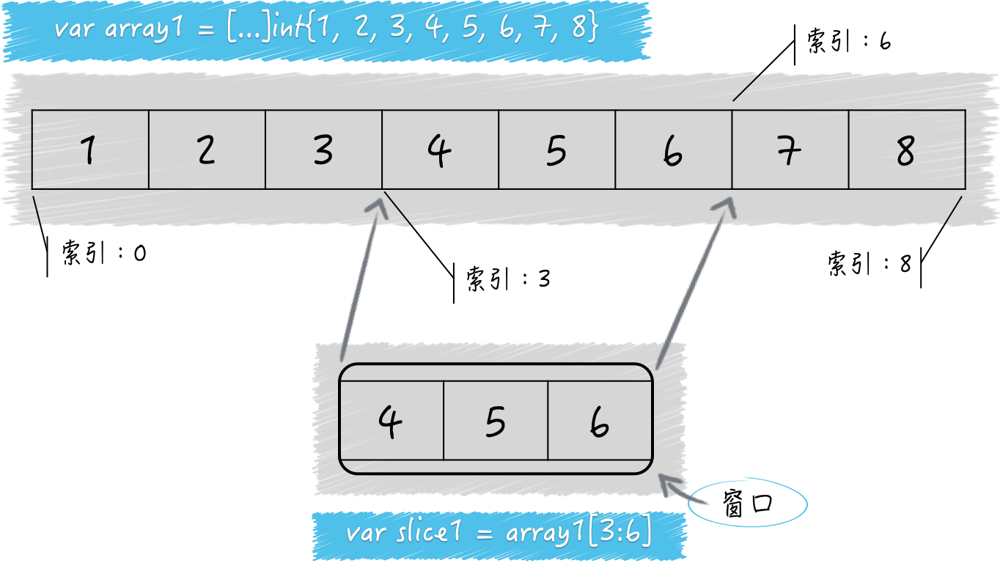

## `Go` 语言的数组（array）类型和切片（slice）类型

它们的共同点是都属于集合类的类型，都可以用来存储一种类型的值。

不同的是数组的长度是固定的，切片是可变长的。

数组的长度是数组类型的一部分，在声明的时候就必须给定，并且之后不能改变。

切片的字面量中只有元素的类型，没有长度。切片的长度可以自动随着元素的数量增长，但不会减少。


切片其实是对数组的简单封装，每个切片的底层数据结构中都会有一个数组。数组是切片的底层数组，切片是数组的某个联系片段的引用。

> 因此，`Go` 语言的切片属于引用类型，同属引用类型的还有字典、通道、函数等；`Go` 语言的数组属于值类型，同属值类型的还有基础数据类型和结构体类型。
>
> `Go` 语言中不存在 传值或传引用的问题，判断传值还是传引用只要看被传递的值的类型就好。传递的值是引用类型，那么就是传引用。传递的值是值类型，那么就是传值。从传递成本上来讲，引用类型的值通常比值类型低很多。
>
> 数组和切片都可以使用索引表达式，得到某个元素的值。也可以使用切片表达式，得到一个新的切片。

通过内建函数 `len` 可以得到数组和切片的长度，通过内建函数 `cap` 可以得到他们的容量。

数组的长度永远等于容量，都是不可变的。切片的容量是会变的，并且有规律可循。

### 怎样估算切片的长度和容量

先来看一段代码：

```go
package main

import "fmt"

func main() {
	s1 := make([]int, 5)
	fmt.Printf("the length of s1: %d\n", len(s1))
	fmt.Printf("the capacity of s1: %d\n", cap(s1))
	fmt.Printf("the value of s1: %d\n", s1)

	s2 := make([]int, 5, 8)
	fmt.Printf("the length of s2: %d\n", len(s2))
	fmt.Printf("the capacity of s2: %d\n", cap(s2))
	fmt.Printf("the value of s2: %d\n", s2)
}
```

使用内建函数 `make` 声明了一个 `[]int` 类型的切片 `s1` ，传给 `make` 的第二个参数 5 指明了切片的长度。

同样的方式声明了切片 `s2`，只不过多传了参数 8 指明了切片的容量。

执行 `go run main.go` 查看结果：

```go
the length of s1: 5
the capacity of s1: 5
the value of s1: [0 0 0 0 0]
the length of s2: 5
the capacity of s2: 8
the value of s2: [0 0 0 0 0]
```

我们看到，如果不指定切片的容量，那么它就和切片的长度一致。如果指定了切片容量，那么就是指定的大小。

我们前面说过，切片是对底层数组的封装。切片的底层数据结构是数组，而切片也是对数组一段连续片段的引用。

想象一下，有一个窗口，我们可以通过这个窗口看到一个数组，但是不一定能看到所有元素 ，有时候只能看到连续的一部分。

所以这里 `s2` 的容量代表底层数组的长度是 8。而 `s2` 本身的长度是 5，那面 `s2` 的值就是底层数组中的第 1 个元素到第 5 个元素，对应的底层数组索引范围就是 [0，4]。

切片代表的窗口也会被划分为一个个的小格子，每个小格子都对应底层数组的一个元素。

当我们使用 `make` 函数或切片字面量（如：`[]int{1, 2, 3}`）初始化一个切片时，切片的第一个元素总是对应底层数组的第一个元素。

当我们通过切片表达式基于某个数组或者切片生成新的切片时，则不一定：

```go
s3 := []int{1, 2, 3, 4, 5, 6, 7, 8}
s4 := s3[3:6]
fmt.Printf("the length of s4: %d\n", len(s4))
fmt.Printf("the capacity of s4: %d\n", cap(s4))
fmt.Printf("the value of s4: %d\n", s4)
```

`s3` 有 8 个元素，长度和容量都是 8。然后我们用切片表达式 `s3[3:6]` 初始化了切片 `s4`。

看下结果：

```go
the length of s4: 3
the capacity of s4: 5
the value of s4: [4 5 6]
```

可见，表达式 `s3[3:6]` 表示从 `s3` 中可见索引范围为 3 到 5，并不包括 6。

这里的 3 是起始索引，6 是结束索引。所以 `s4` 的长度就是 6 减去 3，即 3。



再来看容量，一个切片的容量可以被看作是透过这个窗口最多可以看到底层数组中元素的个数。

由于 `s4` 是在 `s3` 的基础上得来的，所以 `s3` 可以看作 `s4` 的底层数组。

又因为，在底层数组不变的情况下，切片代表的窗口可以向右扩展，直到底层数组的末尾。

所以，`s4` 的容量就是底层数组的长度 8，减去起始索引 3，即 5。

注意，切片是无法向左扩展的，就是说我们永远无法通过 `s4` 看到 `s3` 中最左侧的 3 个元素。

### 怎样估算切片容量的增长

当切片无法容纳更多元素时，`Go` 语言就会想办法扩容。这并不会改变原来的切片，而是生成一个容量更大的切片，然后把原有的元素和新元素一并拷到新切片中。一般情况下，新切片的容量会是原有切片容量的 2 倍。

```go
s6 := make([]int, 0)
fmt.Printf("The capacity of s6: %d\n", cap(s6))
for i := 1; i <= 5; i++ {
  s6 = append(s6, i)
  fmt.Printf("s6(%d): len: %d, cap: %d\n", i, len(s6), cap(s6))
}

//The capacity of s6: 0
//s6(1): len: 1, cap: 1
//s6(2): len: 2, cap: 2
//s6(3): len: 3, cap: 4
//s6(4): len: 4, cap: 4
//s6(5): len: 5, cap: 8
```

当原有切片的长度大于或等于 1024 时，`Go` 语言将会以原容量的 1.25 倍作为新容量的基准。新容量基准会被调整（不断的与 1.25 相乘），直到结果不小于原有长度和要追加的元素数量之和。最终，新容量往往会比新长度大一些，也可能相等。

```go
s7 := make([]int, 1024)
fmt.Printf("The capacity of s7: %d\n", cap(s7))
s7e1 := append(s7, make([]int, 200)...)
fmt.Printf("s7e1: len: %d, cap: %d\n", len(s7e1), cap(s7e1))
s7e2 := append(s7, make([]int, 400)...)
fmt.Printf("s7e2: len: %d, cap: %d\n", len(s7e2), cap(s7e2))
s7e3 := append(s7, make([]int, 600)...)
fmt.Printf("s7e3: len: %d, cap: %d\n", len(s7e3), cap(s7e3))

//The capacity of s7: 1024
//s7e1: len: 1224, cap: 1280
//s7e2: len: 1424, cap: 1696
//s7e3: len: 1624, cap: 2048
```

如果一次追加元素过多，导致新长度超过原容量的 2 倍，那么新容量就会以新长度为基准。当然，新容量很多时候会比新容量基准大一些。

```go
s8 := make([]int, 10)
fmt.Printf("The capacity of s8: %d\n", cap(s8))
s8a := append(s8, make([]int, 11)...)
fmt.Printf("s8a: len: %d, cap: %d\n", len(s8a), cap(s8a))
s8b := append(s8a, make([]int, 23)...)
fmt.Printf("s8b: len: %d, cap: %d\n", len(s8b), cap(s8b))
s8c := append(s8b, make([]int, 45)...)
fmt.Printf("s8c: len: %d, cap: %d\n", len(s8c), cap(s8c))

//The capacity of s8: 10
//s8a: len: 21, cap: 22
//s8b: len: 44, cap: 44
//s8c: len: 89, cap: 96
```

### 切片的底层数组什么时候被替换

确切的说，切片的底层数组永远不会被替换。因为扩容的时候会生成新的底层数组，同时也生成了新的切片。

它只是把新的切片作为了新的底层数组的窗口，并没有对原切片和原底层数组做任何改动。

无需扩容时，`append` 函数返回的是指向原底层数组的原切片，需要扩容时，`append` 函数返回的是指向新底层数组的新切片。

只要新长度不超过切片的原容量，就不会引起扩容。只会使底层数组中对应的元素被替换掉。

```go
a1 := [7]int{1, 2, 3, 4, 5, 6, 7}
fmt.Printf("a1: %v (len: %d, cap: %d)\n",
           a1, len(a1), cap(a1))
s9 := a1[1:4]
//s9[0] = 1
fmt.Printf("s9: %v (len: %d, cap: %d)\n",
           s9, len(s9), cap(s9))
for i := 1; i <= 5; i++ {
  s9 = append(s9, i)
  fmt.Printf("s9(%d): %v (len: %d, cap: %d)\n",
             i, s9, len(s9), cap(s9))
}
fmt.Printf("a1: %v (len: %d, cap: %d)\n",
           a1, len(a1), cap(a1))

//a1: [1 2 3 4 5 6 7] (len: 7, cap: 7)
//s9: [2 3 4] (len: 3, cap: 6)
//s9(1): [2 3 4 1] (len: 4, cap: 6)
//s9(2): [2 3 4 1 2] (len: 5, cap: 6)
//s9(3): [2 3 4 1 2 3] (len: 6, cap: 6)
//s9(4): [2 3 4 1 2 3 4] (len: 7, cap: 12)
//s9(5): [2 3 4 1 2 3 4 5] (len: 8, cap: 12)
//a1: [1 2 3 4 1 2 3] (len: 7, cap: 7)
```

