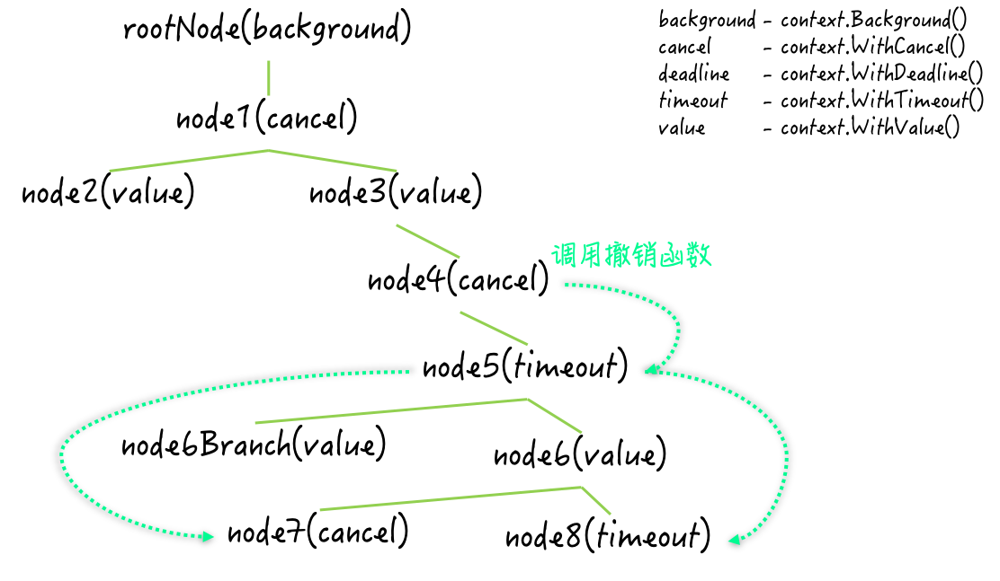

## 怎样使用 context 包

```go
package main

import (
	"context"
	"fmt"
	"sync/atomic"
	"time"
)

func main() {
	total := 12
	var num int32
	fmt.Printf("The number: %d [with context.Context]\n", num)
	cxt, cancelFunc := context.WithCancel(context.Background())
	for i := 1; i <= total; i++ {
		go addNum(&num, i, func() {
			if atomic.LoadInt32(&num) == int32(total) {
				cancelFunc()
			}
		})
	}
	<-cxt.Done()
	fmt.Println("End.")
}

// addNum 用于原子地增加一次numP所指的变量的值。
func addNum(numP *int32, id int, deferFunc func()) {
	defer func() {
		deferFunc()
	}()
	for i := 0; ; i++ {
		currNum := atomic.LoadInt32(numP)
		newNum := currNum + 1
		time.Sleep(time.Millisecond * 200)
		if atomic.CompareAndSwapInt32(numP, currNum, newNum) {
			fmt.Printf("The number: %d [%d-%d]\n", newNum, id, i)
			break
		} else {
			//fmt.Printf("The CAS operation failed. [%d-%d]\n", id, i)
		}
	}
}
```

上面个例子中，首先调用了 context.BackGround 函数和 context.WithCancel 函数，并得到了一个可撤销的 context.Context 类型的值和一个 context.CancelFunc 类型的撤销函数分别用变量 cxt 和 cancelFunc 接收。

然后通过 for 循环中通过 go 语句迭代异步调用 addNum 函数，调用次数依据 total 变量的值。 addNum 函数的最后一个参数是匿名函数，使用 if 语句原子的加载 num 变量的值并判断是否等于 total 变量的值，如果两个值相等，那么就调用 cancelFun 函数。其含义是，如果所有的 addNum 函数都执行完毕，那么就立即通知分发任务的 goroutine。这里的分发任务的 goroutine 就是主 goroutine。它在执行完 for 语句后会立即调用 cxt 的 Done 函数，并试图针对该函数返回的通道进行接收操作。

由于一旦 cancelFunc 函数被调用，针对该通道的接收操作就会马上结束，所以这样也可以实现等待所有的 addNum 函数都执行完毕的功能。

## context 包介绍

context.Context 类型是在 Go 1.7 发布时才被加入到标准库的。之后标准库中的很多其他代码包都为了支持它而进行了扩展，包括：os/exec 包、net 包、database/sql 包以及 runtime/pprof 包和 runtime/trace 包等。

Context 类型之所以受到了标准库中其他代码包的积极支持，主要是因为它是一种非常通用的同步工具。它的值不但可以被任意扩散，而且还可以被用来传递额外的信息和信号。更具体的说，Context 类型可以提供一类代表上下文的值。此类值是并发安全的，也就是说它可以被传播给多个 goroutine。

由于 Context 类型实际上是一个接口类型，而 context 包中实现该接口的所有私有类型都是基于某个数据类型的指针类型，所以，如此传播并不影响该类型值的功能和安全。

Context 类型的值是可以繁衍的，这意味着我们可以通过一个 Context 值产生出任意个子值。这些子值可以携带其父值的属性和数据，也可以影响我们通过其父值传递的信号。

正因为如此，所有的 Context 值共同构成了一颗代表上下文全貌的树形结构。这棵树的树根是一个已经在 context 包中预定义好的 Context 值，它是全局唯一的。通过调用 context.BackGround 函数可以获取到它，我们在上面的例子就是这么做的。

这个上下文根节点仅仅是一个最基本的支点，它不提供任何额外的功能。也就是说，它既不可以撤销，也不能携带任何数据。此外，context 包中还包含了四个用于繁衍 Context 值的函数，即：WithCancel、WithDeadline、WithTimeout 和 WithValue。

这些函数的第一个参数的类型都是 context.Context 并且名称都是 parent。顾名思义，这个位置上的参数对应都是它们将会产生的 Context 值的父值。

WithCancel 函数用于产生一个可撤销的 Context 子值。上面例子中我们通过调用该函数，获得了一个衍生自上下文根节点的 Context 和一个用于触发撤销信号的函数。

WithDeadline 和 WithTimeout 函数都可以被用来产生一个会定时撤销的 parent 子值。

WithValue 函数可以产生一个携带额外数据的 parent 子值。

## 可撤销的在 context 包中代表什么，撤销一个 Context 值又意味着什么

在 Context 类型的声明中有两个方法与撤销息息相关，Done 方法会返回一个元素类型为 struct{} 的接收通道。这个接收通道的用途并不是传递元素值，而是让调用方去感知撤销当前 Context 值的信号。一旦当前的 Context 值被撤销，这里的接收通道就会立即关闭。我们知道，对于一个未包含任何元素值的通道来说，它的关闭会使任何针对它的接收操作立即结束。因此，上面例子中基于调用表达式 cxt.Done 的接收操作才能起到感知撤销信号的作用。

除了让 Context 值的使用方感知到撤销信号，让它们得到撤销的具体原因有时也是很有必要的。这就是 Err 方法的作用，该方法是 Error 类型的，并且值只可能等于 context.Canceled 变量的值或者 context.DeadlineExceeded 变量的值。前者用于表示手动撤销，后者表示到达指定时间撤销。

对于 Context 值来说，撤销这个词如果当名词讲，指的是被用来表达撤销状态的信号。如果当动词来讲，指的就是撤销信号的传达。而可撤销指的是具有传达这种撤销信号的能力。

当我们通过调用 context.WithCancel 函数产生一个可撤销的 Context 值时，还会获得一个用于触发撤销信号的函数。通过调用这个函数，我们就可以触发针对这个 Context 值的撤销信号。一旦触发，撤销信号会立即被传达给这个 Context值，并由它的 Done 方法的结果值表达出来。

撤销函数只负责触发信号，而对应的可撤销的 Context 值也只负责传达信号，它们都不会去管后边具体的撤销操作。实际上，我们的代码可以在感知到撤销信号之后，进行任意的操作，Context 值对此并没有任何的约束。

如果再深究的话，这里的撤销最原始的含义就是，终止程序针对某种请求的相应，或者取消某种指令的处理。这也是 Go 语言团队在创建 context 代码包和 Context 类型时的初衷。

## 撤销信号如何在上下文树中传播

我们知道，context 包中包含了四个用于繁衍 Context 值的函数。其中的 WithCancel、WithDeadline 和 WithTimeout 都是被用来基于给定的 Context 值产生可撤销的子值的。

context 包的 WithCancel 函数在被调用后会产生两个结果值。第一个结果值就是那个可撤销的 Context 值，而第二个结果值则是用于触发撤销信号的函数。

在撤销函数被调用之后，对应的 Context 值会先关闭它内部的接收通道，也就是它的 Done 方法会返回的那个通道。然后，它会向它的所有子值传达撤销信号。这些子值会如法炮制，把撤销信号继续传播下去。最后，这个Context值会断开它与其父值之间的关联。



我们通过调用 context 包的 WithDeadline 函数或者 WithTimeout 函数生成的 Context 值也是可撤销的。它们不但可以被手动撤销，还会依据在生成时被给定的过期时间，自动地进行定时撤销。这里定时撤销的功能是借助它们内部的计时器来实现的。

当过期时间到达时，这两种 Context 值的行为与 Context 值被手动撤销时的行为是几乎一致的，只不过前者会在最后停止并释放掉其内部的计时器。

最后要注意，通过调用 context.WithValue 函数得到的 Context 值是不可撤销的。撤销信号在被传播时，若遇到它们则会直接跨过，并试图将信号直接传给它们的子值。

## 怎么通过 Context 值携带数据，怎么从中获取数据

WithValue 函数在产生新的 Context 值的时候需要三个参数，即：父值、键和值。与字典对于键的约束类似，这里键的类型必须是可判等的。

原因很简单，当我们从中获取数据的时候，它需要根据给定的键来查找对应的值。不过，这种 Context 值并不是用字典来存储键和值的，后两者只是被简单地存储在前者的相应字段中而已。

Context 类型的 Value 方法就是被用来获取数据的。在我们调用含数据的 Context 值的 Value 方法时，它会先判断给定的键，是否与当前值中存储的键相等，如果相等就把该值中存储的值直接返回，否则就到其父值中继续查找。

如果其父值中仍然未存储相等的键，那么该方法就会沿着上下文根节点的方向一路查找下去。

注意，除了含数据的 Context 值以外，其他几种 Context 值都是无法携带数据的。因此，Context 值的 Value 方法在沿路查找的时候，会直接跨过那几种值。

如果我们调用的 Value 方法的所属值本身就是不含数据的，那么实际调用的就将会是其父辈或祖辈的 Value 方法。这是由于这几种 Context 值的实际类型，都属于结构体类型，并且它们都是通过将其父值嵌入到自身，来表达父子关系的。

最后，Context 接口并没有提供改变数据的方法。因此，在通常情况下，我们只能通过在上下文树中添加含数据的 Context 值来存储新的数据，或者通过撤销此种值的父值丢弃掉相应的数据。如果你存储在这里的数据可以从外部改变，那么必须自行保证安全。