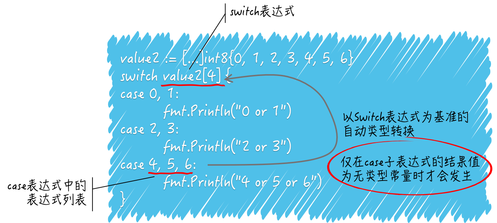

## `for` 语句

### 带 `range` 的 `for` 有哪些细节

`range` 左边的变量只有一个时代表索引值，有两个时，一个索引值，一个元素值。

数组的 `range` 不会修改原值，切片的 `range` 会影响底层数组。

```go
numbers := []int{1, 2, 3, 4, 5, 6}
for i := range numbers{
    if i == 3 {
        numbers[i] |= i
    }
}
fmt.Println(numbers)

// [1 2 3 7 5 6]
```

当 `for` 语句执行时，`range` 右边的 `numbers` 会先被求值。这里的代码被称为 `range` 表达式，它的结果可以是数组、数组的指针、切片、字符串、字典或接收通道中的一个，并且只能一个。

对于不同种类的 `range` 表达式结果值，`for` 语句的迭代变量的数量可以不同。以上面例子来说，它是一个切片，那么迭代变量可以有两个，右边的迭代变量代表档次迭代对应的某一个元素值，左边的迭代变量则代表该元素在切片中的索引值。

```go
for k, v := range numbers{} // k是索引值，v是元素值
```

那么，如果像例子中那样只有一个迭代变量则只会代表档次迭代对应的元素值的索引值。当只有一个迭代变量时，数组、数组的指针、切片和字符串的元素值都是无处安放的，我们只能拿到按照从小到大顺序给出的一个个索引值。

```go
// 数组
numbers := [...]int{1, 2, 3, 4, 5, 6}
maxIndex := len(numbers) - 1
for k, v := range numbers {
    if k == maxIndex {
        numbers[0] += v
    } else {
        numbers[k+1] += v
    }
}
fmt.Println(numbers)

// [7 3 5 7 9 11]
```

这里需要注意两点：

- `range` 表达式只会在 `for` 语句开始执行时求值一次，无论后面有多少次迭代。
- `range` 表达式的求值结果会被复制，就是说被迭代的对象是 `range` 表达式结果值的副本而不是原值。

```go
// 切片
numbers := []int{1, 2, 3, 4, 5, 6}
maxIndex := len(numbers) - 1
for k, v := range numbers {
    if k == maxIndex {
        numbers[0] += v
    } else {
        numbers[k+1] += v
    }
}
fmt.Println(numbers)

// [22 3 6 10 15 21]
```

切片与数组是不同的，前者是引用类型的，而后者是值类型的。

## `switch` 语句

### `switch` 和 `case` 有什么联系

由于需要判等操作，所以两者之间的表达式结果值类型需要相同。

`switch` 语句会进行有限的类型转换，但这不能保证类型的统一。

如果某个表达式的结果值类型是接口类型，一定要小心检查它们的动态值是否具有可比性。

```go
numbers := [...]int8{0, 1, 2, 3, 4, 5, 6}
switch 1 + 3 {
	case numbers[0], numbers[1]:
    fmt.Println("0 or 1")
    case numbers[2], numbers[3]:
    fmt.Println("2 or 3")
    case numbers[4], numbers[5], numbers[6]:
    fmt.Println("4 or 5 or 6")
}

//	.\main1.go:8:2: invalid case numbers[0] in switch on 1 + 3 (mismatched types int8 and int)
//	.\main1.go:8:2: invalid case numbers[1] in switch on 1 + 3 (mismatched types int8 and int)
//	.\main1.go:10:2: invalid case numbers[2] in switch on 1 + 3 (mismatched types int8 and int)
//	.\main1.go:10:2: invalid case numbers[3] in switch on 1 + 3 (mismatched types int8 and int)
//	.\main1.go:12:2: invalid case numbers[4] in switch on 1 + 3 (mismatched types int8 and int)
//	.\main1.go:12:2: invalid case numbers[5] in switch on 1 + 3 (mismatched types int8 and int)
//	.\main1.go:12:2: invalid case numbers[6] in switch on 1 + 3 (mismatched types int8 and int)
```

`switch` 表达式的结果值与某个 `case` 表达式中任何一个子表达式的结果值相等，该 `case` 表达式所属的 `case` 就被选中，其附带的语句就会被执行，同时，其他的 `case` 子句就会被忽略。除非被选中的子句中包含了 `fallthrough` 语句，那么紧挨着它的下一个 `case` 也会被执行。

正因为存在上述判等操作，`switch` 语句对 `switch` 表达式以及各个 `case` 表达式的结果类型是有要求的。毕竟，`Go` 语言中只有类型相同的值之间才可能被允许进行判等操作。

如果 `switch` 表达式的结果值是无类型的常量，比如 1 + 3 的求值结果就是无类型常量 4，那么这个常量会自动转换为此常量默认类型的值，比如整数 4 的默认类型是 `int`，比如浮点数 3.14 的默认类型是 `float`。

因此，上述代码中 `switch` 表达式的结果值是 `int` 类型，而 `case` 表达式的结果值是 `int8`，它们的类型并不相同，所以这里是无法通过编译的。

```go
numbers := [...]int8{0, 1, 2, 3, 4, 5, 6}
switch numbers[4] {
    case 0, 1:
    fmt.Println("0 or 1")
    case 2, 3:
    fmt.Println("2 or 3")
    case 4, 5, 6:
    fmt.Println("4 or 5 or 6")
}

// 4 or 5 or 6
```

与刚才那个例子相反，这个例子的 `switch` 表达式结果值类型是 `int8`，而 `case` 表达式的结果值类型是无类型常量，却可以通过编译并成功执行。

这是因为，如果 `case` 表达式的结果值是无类型的常量，那么它的类型会被自动转换为 `switch` 表达式的结果类型，又由于上述几个整数都可以被转换为 `int8` 类型，所以这些表达式的结果值进行判等操作是没问题的。

当然了，如果自动转换没有成功，还是不能通过编译的。



### `switch` 语句对 `case` 表达式有哪些约束

`switch` 在 `case` 子句的选择上是具有唯一性的。它不允许 `case` 表达式的结果值存在相等的情况，不论这些结果值是否在同一个 `case` 表达式中。

```go
numbers := [...]int8{0, 1, 2, 3, 4, 5, 6}
switch numbers[4] {
    case 0, 1, 2:
    fmt.Println("0 or 1 or 2")
    case 2, 3, 4:
    fmt.Println("2 or 3 or 4")
    case 4, 5, 6:
    fmt.Println("4 or 5 or 6")
}

//	.\main1.go:38:7: duplicate case 2 in switch
//	previous case at .\main1.go:36:13
//	.\main1.go:40:7: duplicate case 4 in switch
//	previous case at .\main1.go:38:13
```

由于在这三个 `case` 表达式中存在结果值相等的子表达式，所以这个 `switch` 语句无法通过编译。不过，好在这个约束本身还有个约束，那就是只针对结果值为常量的子表达式。

```go
numbers := [...]int8{0, 1, 2, 3, 4, 5, 6}
switch numbers[4] {
    case numbers[0], numbers[1], numbers[2]:
    fmt.Println("0 or 1 or 2")
    case numbers[2], numbers[3], numbers[4]:
    fmt.Println("2 or 3 or 4")
    case numbers[4], numbers[5], numbers[6]:
    fmt.Println("4 or 5 or 6")
}

// 2 or 3 or 4
```

把 `case` 表达式中的常量都换成了诸如 `numbers[4]` 这样的索引表达式，可以绕过上述约束条件。

不过，这种绕过方式对用于类型判断的 `switch` 语句无效，因为 `switch` 和 `case` 表达式都必须由类型字面量来表示，不能通过间接的方式表示。

```go
numbers := interface{}(byte(127))
switch t := numbers.(type) {
    case uint8, uint16:
    fmt.Println("uint8 or uint16")
    case byte:
    fmt.Println("byte")
    default:
    fmt.Println("unsupported type: %T", t)
}

//	.\main1.go:63:2: duplicate case byte in type switch
//		previous case at .\main1.go:61:2
```

`byte` 类型是 `uint8` 类型的别名，它们本质上是同一个类型，只是名称不同。这种情况下，是不能通过编译的，因为表达式 `byte` 和 `uint8` 重复了。