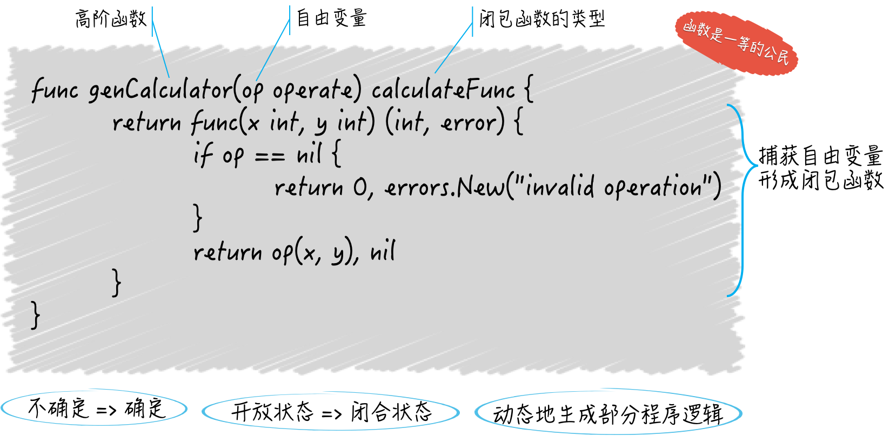

## 函数是一等公民

在 `Go` 语言中，函数可是一等的（first-class）公民，函数类型也是一等的数据类型。

简单来说，这意味着函数不但可以用于封装代码、分割功能、解耦逻辑，还可以化身为普通的值，在其他函数间传递、赋予变量、做类型判断和转换等等，就像切片和字典的值那样。

更深层次来说，函数值可以由此成为能够被随意传播的独立逻辑组件（或者说功能模块）。

对于函数类型来说，它是一种对一组输入、输出进行模板化的重要工具，它比接口类型更加轻巧、灵活，它的值也借此变成了可被热替换的逻辑组件。

```go
package main

import "fmt"

type Printer func(contents string) (n int, err error)

func printToStd(contents string) (bytesNum int, err error) {
	return fmt.Println(contents)
}

func main() {
	var p Printer
	p = printToStd
	p("something")
}
```

这里我们声明了一个函数类型 `Printer`，在类型声明的名称右边的是 `func` 关键字，由此可知是一个函数类型声明。

`func` 右边是函数类型的参数列表和结果列表。其中，参数列表必须用圆括号包裹，而只要结果列表中只有一个结果声明，并且没有为它命名，那么可以省略外面的圆括号。

函数签名的方式与函数声明是一致的。只是紧挨在参数列表左边的不是函数名称，而是关键字 `func`。这里函数名称和 `func` 互换了位置。

> 函数签名其实就是函数的参数列表和结果列表的统称，它定义了可用来鉴别不同函数的那些特征，同时也定义了我们与函数交互的方式。

注意，各个参数和结果的名称不能算作函数签名的一部分，甚至对结果声明来说，没有名称都可以。

只要两个函数的参数列表和结果列表中的元素顺序及其类型是一致的，我们就可以说它们是一样的函数，或者说是实现了同一个函数类型的函数。

严格来说，函数的名称也不能算作函数签名的一部分，它只是我们在调用函数时需要给定的标识符而已。

我们下面声明的 `printToStd` 的签名和 `Printer` 是一致的，因此前者是后者的一个实现，即使他们的名称以及有的结果名称是不一样的。

通过 `main` 函数中的代码，我们就可以证实这两者之间的关系了，我们顺利的把 `printToStd` 赋给了 `Printer` 类型的变量 `p`，并且成功调用了它。

总之，函数是一等公民是函数式编程（functional programming）的重要特征。`Go` 语言在语言层面支持了函数式编程。

## 怎样编写高阶函数

简单的说，高阶函数可以满足下面两个条件：

- 接收其他函数作为参数传入。
- 把其他函数作为结果返回。

只要满足其中任意一个特点，我们就可以说这个函数是一个高阶函数。高阶函数也是函数式编程中重要概念和特征。

例如，有需求需要编写 `calculate` 函数来实现两个整数间的加减乘除计算，但是希望两个整数和具体的操作都由调用方给出。我们来实现它：

首先，声明一个名叫 `operate` 的函数类型，它有两个参数和一个结果，都是 `int` 类型的。

```go
type operate func(x, y int) int
```

然后，我们编写 `calculate` 函数的签名部分。这个函数除了需要两个 `int` 参数，还需要一个 `operate` 类型的参数。

该函数的结果应该有两个，一个 `int` 类型，代表真正的操作结果，另一个 `error` 类型的，表示如果 `operate` 类型的参数为 `nil`，那么就返回一个错误。

> 函数类型属于引用类型，它的值可以为 `nil`，并且它的零值就是 `nil`。

```go
func calculate(x, y int, op operate) (int, error) {
	if op == nil {
		return 0, errors.New("无效操作")
	}
	return op(x, y), nil
}
```

`calculate` 函数的实现比较简单，先用卫述语句检查一下参数，如果 `operate` 类型的参数 `op` 为 `nil`，就直接返回 0 和一个错误。

> 卫述语句是指被用来检查关键的先决条件的合法性，并在检查未通过的情况下立即终止当前代码块的执行。`Go` 语言中，`if` 通常被作为卫述语句。

如果检查无误，那么调用 `op` 并把那两个操作数传给它，最后返回 `op` 的结果和表示没有错误发生的 `nil`。

```go
func main() {
	op := func(x, y int) int {
		return x + y
	}
	s, err := calculate(1, 2, op)
	if err != nil {
		fmt.Println(err.Error())
	}
	fmt.Println(s)
}
```

上面这个例子展示了：把函数作为一个普通的值赋给一个变量；让函数在其他函数间传递。

那么 `calculate` 函数就是一个高阶函数，该函数接受其他函数作为参数传入。

第二个特点：把其他函数作为返回结果。可见以下代码：

```go
package main

import (
	"errors"
	"fmt"
)

type operates func(x, y int) int

type calculator func(x, y int) (int, error)

func genCalculator(op operates) calculator {
	return func(x, y int) (int, error) {
		if op == nil {
			return 0, errors.New("无效操作")
		}
		return op(x, y), nil
	}
}

func main() {
	op := func(x, y int) int {
		return x + y
	}

	x, y := 56, 78
	add := genCalculator(op)
	result, err := add(x, y)
	fmt.Printf("The result: %d (error: %v)\n", result, err)
}
```

## 如何实现闭包

什么是闭包，在一个函数中存在对外来标识符的引用，这个外来标识符既不代表当前函数的任何参数或结果，也不是函数内部声明的，它是从外部直接拿过来的。

还有专门的术语称呼它，自由变量，可见它代表的肯定是个变量。实际上，如果它是个常量，那也就形成不了闭包了，因为常量是不可变的程序实体，而闭包体现的却是由不确定变为确定的一个过程。

闭包函数就是因为引用了自由变量，而呈现出一种不确定的状态，也叫开放状态。也就是说，它的内部逻辑是不完整的，有一部分逻辑需要自由变量参与完成，而自由变量到底代表了什么在闭包函数被定义的时候是不确定的。

即使对于像 `Go` 语言这种静态语言，在定义闭包函数时也只能知道自由变量的类型。

上面那个例子中提到的 `genCalculator` 函数内部就实现了闭包函数，该函数也是高阶函数。

```go
func genCalculator(op operates) calculator {
	return func(x, y int) (int, error) {
		if op == nil {
			return 0, errors.New("无效操作")
		}
		return op(x, y), nil
	}
}
```

`genCalculator` 函数只做了一件事，定义了一个匿名的、`calculator` 类型的函数并把它返回。

这个匿名函数就是一个闭包函数。它里面使用的 `op` 既不代表它的任何参数或结果也不是它自己声明的，而是外层函数的参数，对它来说是自由变量。

这个自由变量代表了什么，定义闭包函数时是不确定的，定义外层函数时才能确定。



表面上看，我们只是延迟实现了一部分程序逻辑或功能，但实际上我们是在动态的生成那部分程序逻辑。我们可以借此在程序运行的过程中，根据需要生成功能不同的函数，继而影响后续的程序行为。

## 传入函数中的那些参数值后来怎样了

```go
package main

import "fmt"

func main() {
  array1 := [3]string{"a", "b", "c"}
  fmt.Printf("The array: %v\n", array1)
  array2 := modifyArray(array1)
  fmt.Printf("The modified array: %v\n", array2)
  fmt.Printf("The original array: %v\n", array1)
}

func modifyArray(a [3]string) [3]string {
  a[1] = "x"
  return a
}
```

所有传给函数的参数值都会被复制，函数在其内部使用的并不是参数值的原值，而是它们的副本。

数组是值类型，每一次复制都会拷贝它以及所有的元素值。而对于切片、字典、通道等引用类型，只会复制它们本身，并不会复制它们的底层数据，也就是浅复制。

以切片值为例，复制的时候只是拷贝了它指向底层数组中某一个元素的指针，以及它的容量和长度，它底层的数组不会被拷贝。

需要注意得是，当传入函数的是一个值类型的参数值，但这个参数值中的某个元素是引用类型的，仍然符合上面的规则。如：

```go
array1 := [3][]string{
    []string{"d", "e", "f"},
    []string{"g", "h", "i"},
    []string{"j", "k", "l"},
}

func modifyArray(a [3][]string) [3][]string {
	a[0][1] = "z"
	a[1] = []string{"a", "b", "c"}
	return a
}
```

上面例子中，对 `a[1]` 的整个元素替换是不会影响原来的数组的，但是对 `a[0][1]` 的替换是会影响到原始数据的。

相关原则：既不要把你的程序细节暴露给外界，也尽量不要让外界的变动影响到你的程序。