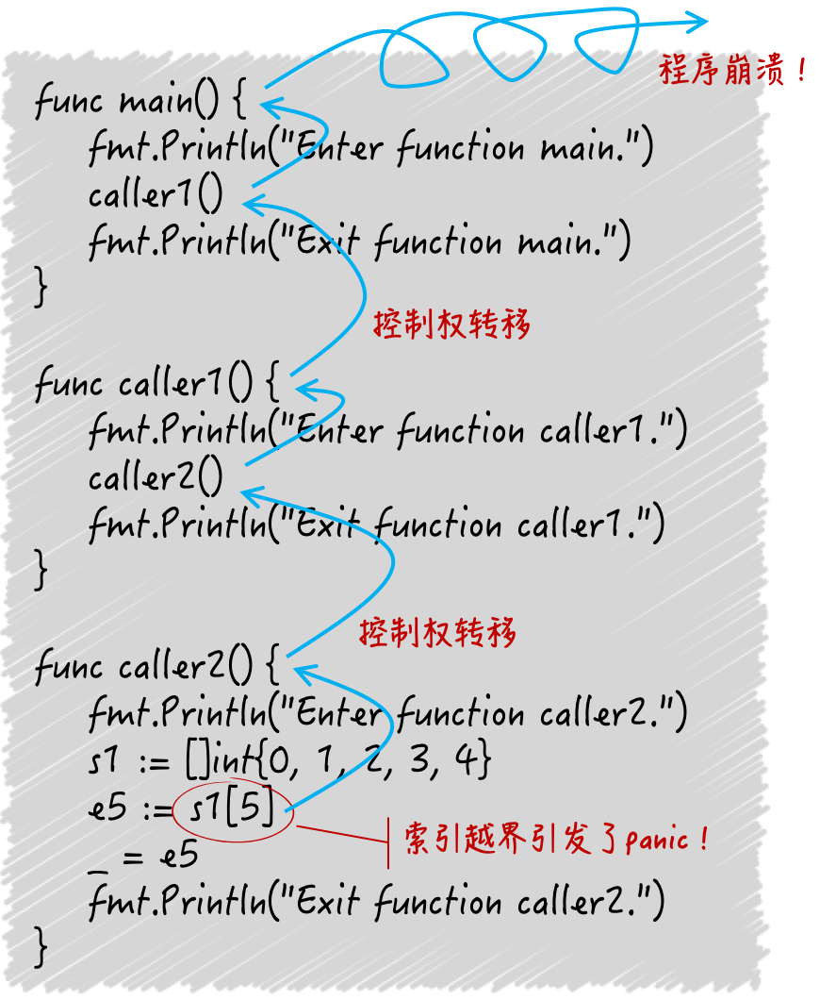

## 运行时恐慌 `panic`

这种程序异常叫做 `panic`，我们把它翻译成运行时恐慌。其中恐慌是由 `panic` 直译过来的，之所以加上运行时是因为这种异常只会在程序运行时的时候抛出来。

```go
package main

import "fmt"

func main() {
	s := []int{0, 1, 2, 3, 4}
	fmt.Println(s[5])
}

//panic: runtime error: index out of range [5] with length 5
//
//goroutine 1 [running]:
//main.main()
///Users/zhangxuesong/gowork/src/gocore/gopanic/main.go:7 +0x1b
//exit status 2
```

上面这个切片只有 5 个元素，而用下标 5 取第 6 个元素肯定不对的。`Go` 运行时系统执行到这一句时会抛出 `panic`，以提示我们索引越界了。如果我们没有在程序里添加任何保护措施，程序打印出 `panic` 详细信息后就会终止运行。

详情中 `runtime error` 表示这是一个 `runtime` 包抛出的 `panic`。其中包含了一个 `runtime.Error` 接口类型的值。`runtime.Error` 接口内嵌了 `error` 接口，并做了一点点扩展，`runtime` 包中有不少它的实现类型。

详情中 `panic: ` 右面的内容正是这个 `panic` 包含的 `runtime.Error` 类型值的字符串表示形式。

此外，`panic` 详情中一般还会包含与它引发原因有关的 `goroutine` 的代码执行信息。正如详情中的 `goroutine 1 [running]:`，它表示有一个 ID 为 1 的 `goroutine` 在此 `panic` 被引发的时候正在运行。这里的 ID 并不重要，它只是 `Go` 运行时系统内部给予的一个编号，我们在程序中是无法获取和更改的。

`main.main()` 表示这个 `goroutine` 包装的 `go` 函数就是命令源码中的 `main` 函数，也就是说这里的 `goroutine` 正是主 `goroutine`。下面一行指出这个 `goroutine` 中的哪一行代码在此 `panic` 被引发时正在执行。这包含了此行代码所属的源码文件中的行数和文件所在的绝对路径。最后的 `+0x1b` 代表此行代码相对于其所属函数的入口程序计数偏移量。一般情况下用处不大。

最后，`exit status 2` 表示这个程序是以退出状态码 2 结束运行的。在大多数操作系统中，只要退出状态码不为 0，都意味着程序运行的非正常结束。在 `Go` 语言中，因 `panic` 导致程序结束运行的退出状态码一般都会是 2。

## 从 `panic` 被引发到程序终止的过程

某个函数中的某行代码有意或无意的引发了一个 `panic`。这时，初始的 `panic` 详情会被建立起来，并且该程序的控制权会从此行代码转移至调用其所属函数的那行代码上，也就是调用栈的上一级。 

这也意味着，此行代码所属的函数的执行随即终止。紧接着，控制权并不会在此有片刻停留，它又会立即转移至再上一级的调用代码处。控制权如此一级一级的沿着调用栈的反方向传播至顶端，也就是我们编写的最外层函数那里。

这里的最外层函数指的是 `go` 函数，对于主 `goroutine` 来说就是 `main` 函数。但是控制权也不会停留在那里，而是被 `Go` 运行时系统回收。

随后，程序崩溃并终止运行，承载程序这次运行的进程也会随之死亡和消失。与此同时，在这个控制传播过程中，`panic` 详情会主键的积累和完善，并会在程序终止之前被打印出来。

`panic` 可能是我们在无意间引发的，如前文所属的索引越界。这类 `panic` 是真正的、在我们意料之外的程序异常。除此之外，我们还可以有意的引发 `panic`。

`Go` 语言内建函数 `panic` 是专门用于引发 `panic` 的。该函数使程序开发者可以在程序运行期间报告异常。注意，这与函数返回错误值的意义是完全不同的。当我们的函数返回一个非 `nil` 的错误值时，函数的调用放有权选择不处理，并且不处理的结果往往是不致命的。

这里的不致命是说不至于使程序无法提供任何功能或者直接崩溃并终止运行。

当一个 `panic` 发生时，如果我们不加任何保护措施，那么导致的后果可能是程序崩溃，这显然是致命的。

```go
package main

import (
	"fmt"
)

func main() {
	fmt.Println("Enter function main.")
	caller1()
	fmt.Println("Exit function main.")
}

func caller1() {
	fmt.Println("Enter function caller1.")
	caller2()
	fmt.Println("Exit function caller1.")
}

func caller2() {
	fmt.Println("Enter function caller2.")
	s1 := []int{0, 1, 2, 3, 4}
	e5 := s1[5]
	_ = e5
	fmt.Println("Exit function caller2.")
}
```

提示：`panic` 详情会在控制权传播的过程中，被主键的积累和完善，并且，控制权会一级一级的沿着调用栈反方向传播至顶端。

因此，在针对某个 `goroutine` 的代码执行信息中，调用栈底层的信息会先出现，然后是上一级的调用信息，以此类推，最后才是此调用栈顶端的信息。

```go
Enter function main.
Enter function caller1.
Enter function caller2.
panic: runtime error: index out of range [5] with length 5

goroutine 1 [running]:
main.caller2()
        /Users/zhangxuesong/gowork/src/gocore/gopanic/main1.go:22 +0x85
main.caller1()
        /Users/zhangxuesong/gowork/src/gocore/gopanic/main1.go:15 +0x7e
main.main()
        /Users/zhangxuesong/gowork/src/gocore/gopanic/main1.go:9 +0x7e
exit status 2
```



深入地了解此过程，以及正确地解读 `panic` 详情应该是我们的必备技能，这在调试 `Go` 程序或者为 `Go` 程序排查错误的时候非常重要。

