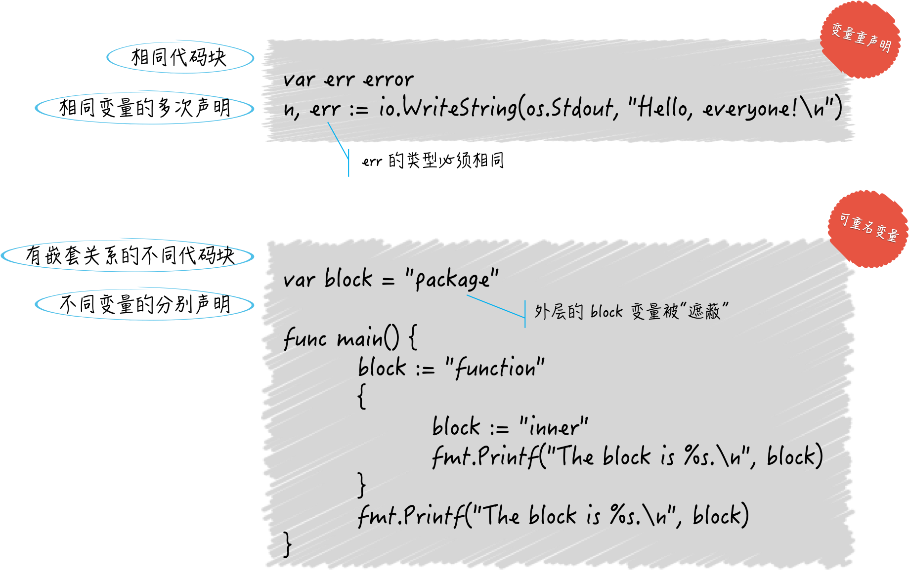

## 作用域是什么

一个程序实体被写出来，就是为了让其他程序引用。哪里的代码可以引用它呢，这就涉及到了它的作用域。

`Go` 语言的访问权限有三种：包级私有的、模块级私有的和公开的。这其实就是 `Go` 语言在语言层面依据代码块对程序实体作用域进行的定义。

我在函数里面声明了一个变量，一般情况下这个变量无法被函数外部使用。变量的作用域就被限定在函数体里面。

所以，一个程序实体的作用域总是会被限制在某个代码块中，而这个作用域最大的用处，就是对程序实体的访问权限的控制。

### 一个变量与其外层代码块中的变量重名会怎样

```go
package main

import "fmt"

var block = "package"

func main() {
	block := "function"
	{
		block := "inner"
		fmt.Printf("this block is %s!\n", block)
	}
	fmt.Printf("this block is %s!\n", block)
}
```

这段代码里面有四个代码块：全局代码块、`main` 包代码块、`main` 函数代码块和函数内部一对花括号代码块。

执行 `go run main.go` ：

```go
this block is inner!
this block is function!
```

我们发现当前代码块里面的变量会把外层代码块的变量覆盖掉。这是因为 `Go` 语言中的变量查找过程：

- 首先，代码引用变量时优先查找当前代码块中的变量。
- 其次，如果当前代码块中没有声明该变量，那么会沿着嵌套关系一层一层往上找。
- 一般会查到当前代码块所在的代码包，如果仍然查不到，就会报编译错误。

> 有个特殊情况，如果使用 `import . "XXX"` 的形式引入代码包，那么该包会被视为当前代码包中的程序实体。

### 不同代码块的重名变量（可重名变量）和变量重声明中的变量区别

- 变量重声明的变量是在同一个代码块内的，而可重名变量是在不同代码块之间由相同标识符代表的变量。
- 变量重声明是对同一个变量多次声明，是针对一个变量，而可重名变量是多个变量。
- 变量重声明不论声明多少次，变量的类型是首次声明就确定了的，而可重名变量的类型不受限制。
- 可重命名变量所在的代码块之间是存在直接或间接的嵌套关系的，他们之间一定会存在”屏蔽“的现象。



