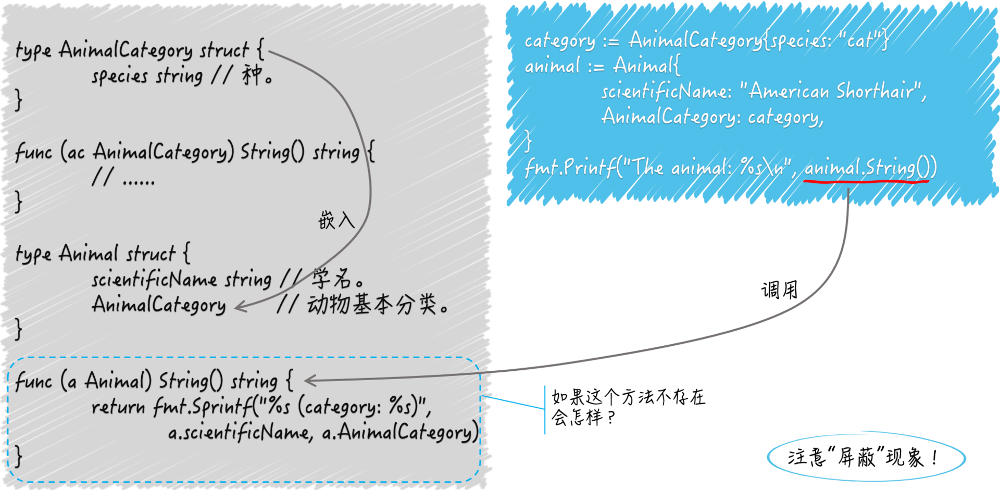

## 结构体类型基础知识

结构体表示的是实实在在的数据结构。一个结构体类型可以包含若干个字段，每个字段通常都需要有确切的名字和类型。

结构体也可以不包含任何字段，我们还可以为类型关联上一些方法，这里可以把方法看成是函数的特殊版本。

函数是独立的程序实体。可以声明有名字的函数，也可以声明没名字的函数，还可以把函数当成普通的值传来传去。可以把具有相同签名的函数抽象成独立的函数类型，作为一组输入、输出（或者说一类逻辑组件）的代表。

方法却不同，它需要有名字，不能被当做值来看待，最重要的是，它必须隶属某一个类型。方法所属的类型会通过其声明中的接收者（receiver）声明体现出来。

接收者声明就是关键字 `func` 和方法名称之间的圆括号包裹起来的内容，其中必须包含确切的名称和类型字面量。

接收者的类型就是当前方法所属的类型，接收者的名称就是在当前方法中引用它所属类型的当前值。

```go
// AnimalCategory 代表动物分类学中的基本分类法。
type AnimalCategory struct {
	kingdom string // 界。
	phylum  string // 门。
	class   string // 纲。
	order   string // 目。
	family  string // 科。
	genus   string // 属。
	species string // 种。
}

func (ac AnimalCategory) String() string {
  return fmt.Sprintf("%s%s%s%s%s%s%s",
    ac.kingdom, ac.phylum, ac.class, ac.order,
    ac.family, ac.genus, ac.species)
}
```

结构体类型 `AnimalCategory` 代表了动物的基本分类法，其中有 7 个 `string` 类型的字段，分别表示各个等级的分类。

下边有个名叫 `String` 的方法，从它的接收者声明可以看出它隶属于 `AnimalCategory` 类型。

通过该方法的接收者名称 `ac`，我们可以在其中引用到当前值的任何一个字段，或者调用到当前值的任何一个方法（也包括 `String` 方法自己）。

这个 `String` 方法的功能是提供当前值的字符串表示形式，其中的各个等级分类会按照从大到小的顺序排列。使用时，我们可以这样表示：

```go
category := AnimalCategory{species: "cat"}
fmt.Printf("The animal category: %s\n", category)
```

这里，我用字面量初始化了一个 `AnimalCategory` 类型的值，并把它赋给了变量 `category`。为了不喧宾夺主，我只为其中的 `species` 字段指定了字符串值"cat"，该字段代表最末级分类“种”。

在 `Go` 语言中，我们可以通过为类型编写名为 `String` 的方法，来自定义该类型的字符串表示形式。这个 `String` 方法不需要任何参数声明，但需要一个 `string` 类型的结果声明。

> 方法隶属的类型并不局限于结构体类型，但必须是某个自定义的数据类型，而且不能是任何接口类型。
>
> 一个数据类型关联的所有方法，共同组成了该类型的方法集合。同一个方法集合中的方法不能出现重名。如果它们所属的数据类型是结构体，那面它们的名称和该类型中的任何字段也不能重名。
>
> 结构体的字段是它的一个属性或者一项数据，隶属它的方法是附加在其数据上的一项操作或者能力。将属性及其能力封装在一起是面向对象的一个主要原则。
>
> `Go` 语言摄取了面向对象编程中的很多优秀特性，同时也推荐这种封装的做法。从这方面看，`Go` 语言是支持面向对象编程的，但它选择摒弃了一些在实际运用过程中容易引起程序开发者困惑的特性和规则。

## 结构体类型的嵌套

```go
type Animal struct {
	scientificName string // 学名。
	AnimalCategory        // 动物基本分类。
}
```

`Go` 语言规范规定，如果一个字段的声明中只有字段类型名而没有字段名称，那么它就是一个嵌入字段，也被称为匿名字段。可以通过此类型变量名跟 `.`，再跟嵌入字段类型的方式引用到该字段，也就是说，嵌入字段的类型既是类型也是名称。

```go
func (a Animal) Category() string {
	return a.AnimalCategory.String()
}
```

在某个代表变量的标识符右边加 `.`，再加上字段名或方法名的表达式被称为选择表达式，它用来表示选择了该变量的某个字段或方法。

嵌入字段的方法集合会被无条件的合并进被嵌入类型的方法集合中：

```go
animal := Animal{
    scientificName: "American Shorthair",
    AnimalCategory: category,
}
fmt.Printf("The animal: %s\n", animal)
```

这里并没有给 `Animal` 编写 `String` 方法，但是是没问题的，嵌入字段 `AnimalCategory` 的 `String` 方法会被当做 `animal` 的方法调用。

## 嵌入类型和被嵌入类型方法重名会怎样

嵌入类型相当于父类，被嵌入类型相当于子类，当双方有方法重名时，子类方法覆盖父类方法，就是说嵌入类型的方法会被屏蔽。

不论这两个方法的签名是否相同，只要名称一样，被嵌入类型的方法都会屏蔽掉嵌入类型的方法。

类似的，我们同样可以像访问被嵌入类型的字段那样直接访问嵌入类型的字段，所以如果这两个结构体类型里存在同名字段，那么嵌入类型中的字段一定会被屏蔽。

正因为嵌入类型的字段和方法都会集合到被嵌入类型上，所以即使两个类型的成员一个是字段，一个是方法，也会有这种屏蔽现象。

不过即使被屏蔽了，我们仍然可以通过链式的选择表达式，选择到嵌入类型的字段或方法。

```go
func (a Animal) String() string {
	return fmt.Sprintf("%s (category: %s)",
		a.scientificName, a.AnimalCategory)
}
```

在这里，我们把对嵌入类型的 `String` 方法的调用结果融入到了 `Animal` 类型的同名方法的结果中。



## 多层嵌入的问题

```go
type Cat struct {
	name string
	Animal
}

func (cat Cat) String() string {
	return fmt.Sprintf("%s (category: %s, name: %q)",
		cat.scientificName, cat.Animal.AnimalCategory, cat.name)
}
```

嵌入字段本身也有嵌入字段，这种情况下的屏蔽现象会以嵌入字段的层级为依据，层级越深的字段或方法越可能被屏蔽。

处于同一级别的多个嵌入字段拥有相同的字段或方法，会依次执行。

## `Go` 语言是用嵌入字段实现了继承吗

`Go` 语言中没有继承的概念，只是通过嵌入字段的方式实现了类型之间的组合。

简单来说，面向对象编程中的集成，其实是通过牺牲一定的代码简洁性来换取可扩展性，而且这种可扩展性是通过侵入的方式来实现的。

类型之间的组合采用的是非声明的方式，我们不需要显示的声明某个类型实现了某个接口，或一个类型继承了另一个类型。同时，类型组合也是非侵入式的，它不会破坏类型的封装或加重类型之间的耦合。

我们要做的只是把类型当做字段嵌入进来，然后坐享其成的使用嵌入字段所拥有的一切。如果嵌入字段哪里不合心意，还可以用屏蔽的方式来调整和优化。

类型组合要比继承更加简洁和清晰，`Go` 语言可以轻而易举地通过嵌入多个字段来实现功能强大的类型，却不会有多重继承那样复杂的层次结构和可观的管理成本。

## 值方法和指针方法都是什么意思，有什么区别

所谓的值方法，就是接收者类型是非指针的自定义类型的方法。

```go
func (cat *Cat) SetName(name string) {
  cat.name = name
}
```

所谓的指针方法，就是接收者类型是上述指针类型的方法。

它们之间有如下几点不同：

- 值方法的接收者是该方法所属的那个类型值的一个副本。我们在该方法内对该副本的修改一般不会体现在原值上，除非这个类型本身是某个引用类型（切片或字典）的别名类型。而指针方法的接收者，是该方法所属的那个基本类型值的指针值的一个副本。我们在这样的方法内对该副本指向的值进行修改，一定会体现在原值上。
- 一个自定义数据类型的方法集合中仅包含它所有的值方法，而该类型的指针方法却包含了所有的值方法和指针方法。严格来讲，我们在这样的基本类型值上只能调用它的值方法，但是，`Go` 语言会适时的为我们进行自动转译，使得我们在值上也能调用它的指针方法。即：先取它的指针值，然后在指针上调用指针方法。
- 一个类型的方法集合中有哪些方法与它能实现哪些接口类型是相关的。如果一个基本类型和它的指针类型的方法集合不同，那么它具体实现的接口类型的数量也会有差异，除非这两个都是零。如，一个指针类型实现了某个接口类型，但它的基本类型却不一定能够作为该接口的实现类型。