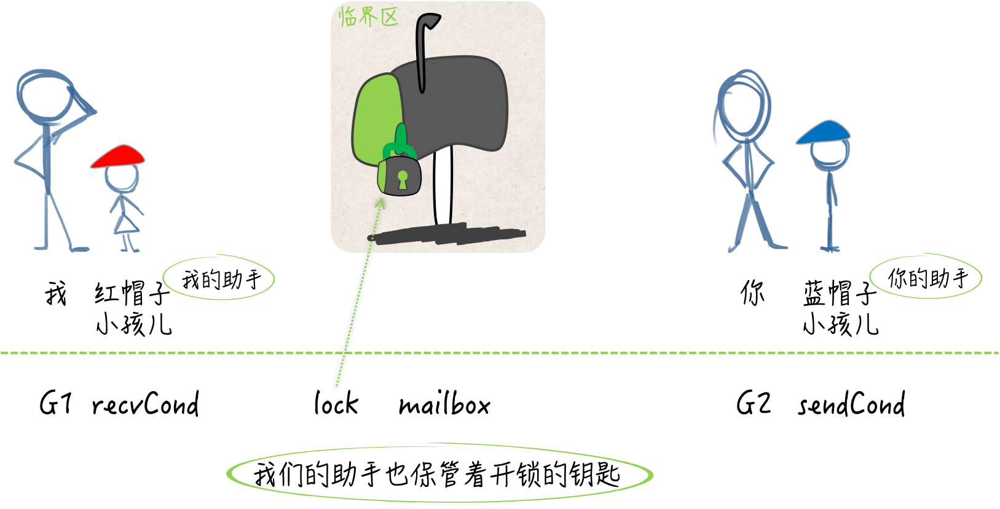

## 条件变量与互斥锁

条件变量是基于互斥锁的，它必须有互斥锁的支撑才能发挥作用。

条件变量并不是被用来保护临界区和共享资源的，它是用于协调想要访问共享资源的那些线程的。当共享资源的状态发生变化时，它可以被用来通知被互斥锁阻塞的线程。

比如，我们两个人在共同执行一项秘密任务，这需要在不直接联系和见面的前提下进行。我需要向一个信箱里放置情报，你需要从这个信箱里获取情报。这个信箱就相当于一个共享资源，而我们就分别是进行写操作和读操作的线程。

如果我在放置情报的时候发现信箱里还有未被取走的情报，那就不再放置并且先返回。另一面，如果你在获取情报的时候发现信箱里没有情报，也只能先回去了。这就相当于写操作和读操作线程阻塞。

虽然我们俩都有信箱的钥匙，但同一时刻只能有一个人插入钥匙打开信箱，这就是锁的作用了。更何况我们两个人不能直接见面，所以这个信箱本身可以视为一个临界区。

尽管没有协调好，咱们俩仍然要想办法完成任务。所以，如果信箱里有情报，而你却一直没取走，那我就需要每隔一段时间带着新情报去检查一次，若发现信箱空了，我要及时的把新情报放进去。

另一面，如果信箱里一直没有情报，你也要每隔一段时间去查看，一旦有了情报要及时取走。这么做是可以的，但是很危险，容易被敌人发现。

后来，我们又想了一个计策，各自雇了一个不起眼的小孩儿。如果早上七点有个戴红色帽子的小孩儿从你家楼下路过，那面就意味着信箱里有了新的情报。如果上午九点有个戴蓝色帽子的小孩儿从我家楼下路过，那说明你已经从信箱里取走了情报。

这样，执行任务的隐蔽性高多了，并且效率的提升非常显著。这两个戴不同颜色帽子的小孩儿就相当于条件变量，在共享资源的状态发生变化时，起到了通知的作用。

条件变量在这里最大的优势就是效率方面的提升。当共享资源的状态不满足条件时，想操作它的线程再也不用循环往复的做检查了，只要等待通知就好了。

## 条件变量怎样配合互斥锁

条件变量的初始化离不开互斥锁，并且它的方法有的也是基于互斥锁的。

条件变量提供的方法有三个：等待通知（wait）、单发通知（signal）和广播通知（broadcast）。

我们再利用条件变量等待通知的时候，需要在它基于的那个互斥锁保护下进行。而在进行单发或者广播通知的时候，需要在对应的互斥锁解锁之后再做操作。

```go
package main

import (
	"log"
	"sync"
	"time"
)

func main() {
	//信箱，0表示空，1表示非空
	var mailBox uint8
	//互斥锁
	var lock sync.RWMutex
	//发送条件
	sendCond := sync.NewCond(&lock)
	//接收条件
	recvCond := sync.NewCond(lock.RLocker())

	//信号通道
	sign := make(chan struct{}, 3)
	max := 5

	//发送方
	go func(max int) {
		defer func() {
			sign <- struct{}{}
		}()
		for i := 1; i <= max; i++ {
			time.Sleep(time.Nanosecond * 500)
			//加写锁，我要开始放置信箱了
			lock.Lock()
			//查看信箱是否空，空就放置新消息，非空就等待
			if mailBox == 1 {
				sendCond.Wait()
			}
			log.Printf("发送方 [%d]:邮箱是空的.", i)
			//放置消息了，信箱状态设置非空
			mailBox = 1
			log.Printf("发送方 [%d]: 我放置消息了.", i)
			//解锁，释放资源
			lock.Unlock()
			//通知接收方
			recvCond.Signal()
		}
	}(max)

	//接收方
	go func(max int) {
		defer func() {
			sign <- struct{}{}
		}()
		for j := 1; j <= max; j++ {
			time.Sleep(time.Nanosecond * 500)
			//加读锁
			lock.RLock()
			//查看信箱是否有消息，没有则等待，有则取走
			if mailBox == 0 {
				recvCond.Wait()
			}
			log.Printf("接收方 [%d]: 邮箱里有消息.", j)
			//取走消息
			mailBox = 0
			log.Printf("接收方 [%d]: 我取走消息了.", j)
			//解读锁
			lock.RUnlock()
			//通知发送方
			sendCond.Signal()
		}
	}(max)

	<-sign
	//<-sign
}
```

变量 mailbox 代表信箱，是 uint8 类型的。若它的值是 0 则表示信箱中没有情报，当它的值是 1 时，说明信箱中有情报。lock 是一个读写锁类型的变量，可以视为信箱上的那把锁。

基于这把锁还有两个代表条件变量的变量：sendCond 和 reveCond。都是 *sync.Cond 类型的，同时也都是由 sync.NewCond 函数来初始化的。

与 互斥锁和读写互斥锁不同，sync.Cond类型并不能开箱即用，我们只能利用 sync.NewCond 函数创建它的指针值。这个函数需要一个 sync.Locker 类型的参数。这里的参数值是不可或缺的，它会参与到条件变量的方法实现中。

sync.Locker 其实是一个接口，在它的声明中只包含了两个方法定义，即：Lock 和 Unlock。互斥锁和读写互斥锁都拥有这两个方法，只不过它们都是指针方法。所以说，这两个类型的指针类型才是 sync.Locker 接口的实现类型。

```go
// A Locker represents an object that can be locked and unlocked.
type Locker interface {
	Lock()
	Unlock()
}
```

我们在为 sendCond 变量做初始化的时候，把基于 lock 变量的指针值传给了 sync.NewCond 函数。lock 变量的 Lock 方法和 Unlock 方法分别用于对其中写锁的锁定和解锁，它们与 sendCond 变量的含义是对应的。sendCond 是专门为放置情报而准备的条件变量，向信箱里放置情报，可以被视为对共享资源的写操作。

相应的，recvCond 变量代表的是专门为获取情报而准备的条件变量。 虽然获取情报也会涉及对信箱状态的改变，但是好在做这件事的人只会有你一个，而且我们也需要借此了解一下，条件变量与读写锁中的读锁的联用方式。所以，在这里，我们暂且把获取情报看做是对共享资源的读操作。

因此，为了初始化 recvCond 这个条件变量，我们需要的是 lock 变量中的读锁，并且还需要是 sync.Locker 类型的。可是，lock 变量中用于对读锁进行锁定和解锁的方法却是 RLock 和 RUnlock，它们与 sync.Locker 接口中定义的方法并不匹配。

好在 sync.RWMutex 类型的 RLocker 方法可以实现这一需求。我们只要在调用 sync.NewCond 函数时，传入调用表达式 lock.RLocker() 的结果值，就可以使该函数返回符合要求的条件变量了。

为什么说通过 lock.RLocker() 得来的值就是 lock 变量中的读锁呢？实际上，这个值所拥有的 Lock 方法和 Unlock 方法，在其内部会分别调用 lock 变量的 RLock 方法和 RUnlock 方法。也就是说，前两个方法仅仅是后两个方法的代理而已。

```go
// RLocker returns a Locker interface that implements
// the Lock and Unlock methods by calling rw.RLock and rw.RUnlock.
func (rw *RWMutex) RLocker() Locker {
	return (*rlocker)(rw)
}

type rlocker RWMutex

func (r *rlocker) Lock()   { (*RWMutex)(r).RLock() }
func (r *rlocker) Unlock() { (*RWMutex)(r).RUnlock() }
```

我们现在有四个变量。一个是代表信箱的 mailbox，一个是代表信箱上的锁的 lock。还有两个是，代表了蓝帽子小孩儿的 sendCond，以及代表了红帽子小孩儿的 recvCond。



我现在是一个 goroutine，想要适时的向信箱里放置情报并通知你，那么肯定要先调用 lock 变量的 Lock 方法。这意味着持有信箱上的锁，并且有打开信箱的权利，并不是锁上这个信箱。

然后我要检查 mailbox 变量的值是不是 1，也就是信箱里是不是存在情报，如果还有，那么我就回家等蓝帽子小孩儿了，也就是 sendCond.Wait 了。如果信箱里没有情报，那么我就把新情报放进去，关上信箱、释放锁，然后离开。

离开之后就让红帽子小孩儿去你家楼下路过，也就是及时通知你，信箱里有新情报了。而你要做的和我在流程上基本一致。只不过操作对象不同。