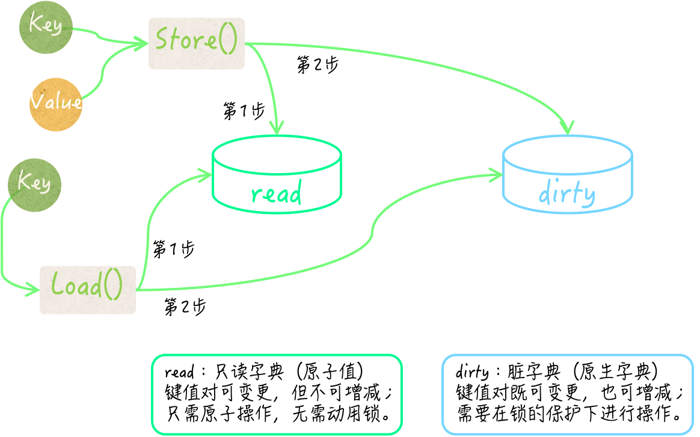

## 怎样保证并发安全字典的键和值的类型正确性

上一篇文章中提到了第一种方案，在编码时就完全确定键和值的类型，然后利用 Go 语言的编译器帮我们做检查。

不过，虽然方便，但是却让这样的字典类型缺少了一些灵活性。如果我们还需要一个键类型为 uint32 并发安全字典的话，那就不得不再如法炮制地写一遍代码了。因此，在需求多样化之后，工作量反而更大，甚至会产生很多雷同的代码。

### 第二种方案

我们封装的结构体类型的所有方法，都可以与 sync.Map 类型的方法完全一致（包括方法名称和方法签名）。

不过，在这些方法中，我们就需要添加一些做类型检查的代码了。另外，这样并发安全字典的键类型和值类型，必须在初始化的时候就完全确定。并且，这种情况下，我们必须先要保证键的类型是可比较的。

所以在设计这样的结构体类型的时候，只包含sync.Map类型的字段就不够了。

```go
type ConcurrentMap struct {
	m         sync.Map
	keyType   reflect.Type
	valueType reflect.Type
}

func NewConcurrentMap(keyType, valueType reflect.Type) (*ConcurrentMap, error) {
	if keyType == nil {
		return nil, errors.New("nil key type")
	}
	if !keyType.Comparable() {
		return nil, fmt.Errorf("incomparable key type: %s", keyType)
	}
	if valueType == nil {
		return nil, errors.New("nil value type")
	}
	cMap := &ConcurrentMap{
		keyType:   keyType,
		valueType: valueType,
	}
	return cMap, nil
}

func (cMap *ConcurrentMap) Delete(key interface{}) {
	if reflect.TypeOf(key) != cMap.keyType {
		return
	}
	cMap.m.Delete(key)
}

func (cMap *ConcurrentMap) Load(key interface{}) (value interface{}, ok bool) {
	if reflect.TypeOf(key) != cMap.keyType {
		return
	}
	return cMap.m.Load(key)
}

func (cMap *ConcurrentMap) LoadOrStore(key, value interface{}) (actual interface{}, loaded bool) {
	if reflect.TypeOf(key) != cMap.keyType {
		panic(fmt.Errorf("wrong key type: %v", reflect.TypeOf(key)))
	}
	if reflect.TypeOf(value) != cMap.valueType {
		panic(fmt.Errorf("wrong value type: %v", reflect.TypeOf(value)))
	}
	actual, loaded = cMap.m.LoadOrStore(key, value)
	return
}

func (cMap *ConcurrentMap) Range(f func(key, value interface{}) bool) {
	cMap.m.Range(f)
}

func (cMap *ConcurrentMap) Store(key, value interface{}) {
	if reflect.TypeOf(key) != cMap.keyType {
		panic(fmt.Errorf("wrong key type: %v", reflect.TypeOf(key)))
	}
	if reflect.TypeOf(value) != cMap.valueType {
		panic(fmt.Errorf("wrong value type: %v", reflect.TypeOf(value)))
	}
	cMap.m.Store(key, value)
}
```

这里 ConcurrentMap 类型代表的是：可自定义键类型和值类型的并发安全字典。这个类型同样有一个 sync.Map 类型的字段 m，代表着其内部使用的并发安全字典。

另外，它的字段 keyType 和 valueType ，分别用于保存键类型和值类型。这两个字段的类型都是 reflect.Type，我们可称之为反射类型。

这个类型可以代表 Go 语言的任何数据类型。并且，这个类型的值也非常容易获得：通过调用 reflect.TypeOf 函数并把某个样本值传入即可。

调用表达式 `reflect.TypeOf(int(123))` 的结果值，就代表了int类型的反射类型值。

我们现在来看一看 ConcurrentMap 类型方法应该怎么写。

先说 Load 方法，这个方法接受一个 interface{} 类型的参数 key，参数 key 代表了某个键的值。

因此，当我们根据 ConcurrentMap 在 m 字段的值中查找键值对的时候，就必须保证 ConcurrentMap 的类型是正确的。由于反射类型值之间可以直接使用操作符 == 或 != 进行判等，所以这里的类型检查代码非常简单。

```go
func (cMap *ConcurrentMap) Load(key interface{}) (value interface{}, ok bool) {
	if reflect.TypeOf(key) != cMap.keyType {
		return
	}
	return cMap.m.Load(key)
}
```

我们把一个接口类型值传入 reflect.TypeOf 函数，就可以得到与这个值的实际类型对应的反射类型值。

因此，如果参数值的反射类型与 keyType 字段代表的反射类型不相等，那么我们就忽略后续操作，并直接返回。

这时，Load 方法的第一个结果 value 的值为 nil，而第二个结果 ok 的值为 false。这完全符合 Load 方法原本的含义。

再来说 Store 方法。Store 方法接受两个参数 key 和 value，它们的类型也都是 interface{}。因此，我们的类型检查应该针对它们来做。

```go
func (cMap *ConcurrentMap) Store(key, value interface{}) {
	if reflect.TypeOf(key) != cMap.keyType {
		panic(fmt.Errorf("wrong key type: %v", reflect.TypeOf(key)))
	}
	if reflect.TypeOf(value) != cMap.valueType {
		panic(fmt.Errorf("wrong value type: %v", reflect.TypeOf(value)))
	}
	cMap.m.Store(key, value)
}
```

这里的类型检查代码与 Load 方法中的代码很类似，不同的是对检查结果的处理措施。当参数 key 或 value 的实际类型不符合要求时，Store 方法会立即引发 panic。

这主要是由于 Store 方法没有结果声明，所以在参数值有问题的时候，它无法通过比较平和的方式告知调用方。不过，这也是符合 Store方法的原本含义的。

如果你不想这么做，也是可以的，那么就需要为 Store 方法添加一个 error 类型的结果。并且，在发现参数值类型不正确的时候，让它直接返回相应的 error 类型值，而不是引发 panic。要知道，这里展示的只一个参考实现，你可以根据实际的应用场景去做优化和改进。

这种方案中我们无需在程序运行之前就明确键和值的类型，只要在初始化并发安全字典的时候，动态地给定它们就可以了。这里主要需要用到 reflect 包中的函数和数据类型，外加一些简单的判等操作。

## 并发安全字典如何做到尽量避免使用锁

sync.Map 类型在内部使用了大量的原子操作来存取键和值，并使用了两个原生的 map 作为存储介质。

其中一个原生 map 被存在了 sync.Map 的 read 字段中，该字段是 sync/atomic.Value 类型的。 这个原生字典可以被看作一个快照，它总会在条件满足时，去重新保存所属的 sync.Map 值中包含的所有键值对。

为了描述方便，我们在后面简称它为只读字典。不过，只读字典虽然不会增减其中的键，但却允许变更其中的键所对应的值。所以，它并不是传统意义上的快照，它的只读特性只是对于其中键的集合而言的。

由 read 字段的类型可知，sync.Map 在替换只读字典的时候根本用不着锁。另外，这个只读字典在存储键值对的时候，还在值之上封装了一层。

它先把值转换为了 unsafe.Pointer 类型的值，然后再把后者封装，并储存在其中的原生字典中。如此一来，在变更某个键所对应的值的时候，就也可以使用原子操作了。

sync.Map 中的另一个原生字典由它的 dirty 字段代表。 它存储键值对的方式与 read 字段中的原生字典一致，它的键类型也是interface{}，并且同样是把值先做转换和封装后再进行储存的。我们暂且把它称为脏字典。

注意，脏字典和只读字典如果都存有同一个键值对，那么这里的两个键指的肯定是同一个基本值，对于两个值来说也是如此。

正如前文所述，这两个字典在存储键和值的时候都只会存入它们的某个指针，而不是基本值。

sync.Map 在查找指定的键所对应的值的时候，总会先去只读字典中寻找，并不需要锁定互斥锁。只有当确定只读字典中没有，但脏字典中可能会有这个键的时候，它才会在锁的保护下去访问脏字典。

相对应的，sync.Map 在存储键值对的时候，只要只读字典中已存有这个键，并且该键值对未被标记为已删除，就会把新值存到里面并直接返回，这种情况下也不需要用到锁。

否则，它才会在锁的保护下把键值对存储到脏字典中。这个时候，该键值对的已删除标记会被抹去。



只有当一个键值对应该被删除，但却仍然存在于只读字典中的时候，才会被用标记为已删除的方式进行逻辑删除，而不会直接被物理删除。

这种情况会在重建脏字典以后的一段时间内出现。不过，过不了多久，它们就会被真正删除掉。在查找和遍历键值对的时候，已被逻辑删除的键值对永远会被无视。

对于删除键值对，sync.Map 会先去检查只读字典中是否有对应的键。如果没有，脏字典中可能有，那么它就会在锁的保护下，试图从脏字典中删掉该键值对。

最后，sync.Map 会把该键值对中指向值的那个指针置为 nil，这是另一种逻辑删除的方式。

除此之外，还有一个细节需要注意，只读字典和脏字典之间是会互相转换的。在脏字典中查找键值对次数足够多的时候，sync.Map 会把脏字典直接作为只读字典，保存在它的 read 字段中，然后把代表脏字典的 dirty 字段的值置为 nil。

在这之后，一旦再有新的键值对存入，它就会依据只读字典去重建脏字典。这个时候，它会把只读字典中已被逻辑删除的键值对过滤掉。理所当然，这些转换操作肯定都需要在锁的保护下进行。


综上所述，sync.Map 的只读字典和脏字典中的键值对集合，并不是实时同步的，它们在某些时间段内可能会有不同。

由于只读字典中键的集合不能被改变，所以其中的键值对有时候可能是不全的。相反，脏字典中的键值对集合总是完全的，并且其中不会包含已被逻辑删除的键值对。

因此，可以看出，在读操作有很多但写操作却很少的情况下，并发安全字典的性能往往会更好。在几个写操作当中，新增键值对的操作对并发安全字典的性能影响是最大的，其次是删除操作，最后才是修改操作。

如果被操作的键值对已经存在于 sync.Map 的只读字典中，并且没有被逻辑删除，那么修改它并不会使用到锁，对其性能的影响就会很小。