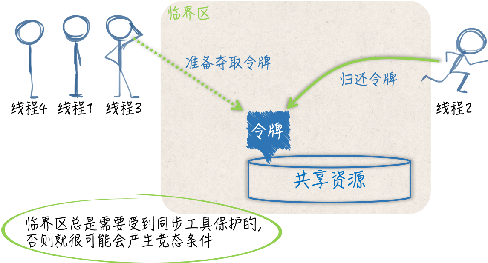

## 静态条件、临界区和同步工具

相比于 Go 语言宣扬的 用通讯的方式共享数据，通过共享数据的方式来传递信息和协调线程运行的做法其实更加主流，毕竟大多数的现代编程语言都是用后一种方式作为并发编程的解决方案的。

一旦数据被多个线程共享，那面就很可能会产生争用和冲突的情况。这种情况也被称为竞态条件（race condition），这往往会破坏共享数据的一致性。

共享数据的一致性代表着某种约定，即：多个线程对共享数据的操作总是可以达到它们各自预期的效果。如果这个一致性得不到保证，那面将会影响到一些线程中代码和流程的正确执行，甚至会造成某种不可预知的错误。这种错误一般很难发现和定位，排查起来的成本也是非常高的，所以一定要尽量避免。

当同时有多个线程向同一个缓冲区写入数据块时，如果没有一个机制去协调这些线程的写入操作的话，那面被写入的数据库就很可能出现错乱。

还记得曾经在一家第三方支付的公司时，每次有人要用打印机前都要大声问有没有人在用，有一次我直接打印了，结果和别人打印的冲突了，一张纸上有我的东西也有另一个同事打印的东西，最后都用不了。当然这是举个例子，在编程来说就是当线程 A 还没有写完一个数据块时，线程 B 就开始写入另外一个数据块了。

显然，这两个数据块中的数据会被混在一起，并且已经很难分清了。因此，这种情况下，我们需要采取一些措施来协调它们对缓冲区的修改。这通常会涉及到同步。

概括来讲，同步的用途有两个，一个是避免多个线程在同一时刻操作同一个数据块，另一个是协调多个线程，以避免它们在同一时刻执行同一个代码块。

由于这样的数据块和代码块的背后都隐含着一种或多种资源（如：存储资源、计算资源、I/O资源、网络资源等），所以我们可以把它们看作是共享资源，或者是共享资源的代表。我们所说的同步其实就是在控制多个线程对共享资源的访问。

一个线程在想要访问某一个共享资源时，需要先申请对该资源的访问权限，并且只有在申请成功后才能真正开始访问。当线程对共享资源的访问结束时，必须归还对该资源的访问权限，再次访问时需要重新申请。

我们可以把访问权限想象成一块令牌，线程一旦拿到了令牌，就可以进入指定区域从而访问到资源。而一旦线程要离开这个区域了，就需要把令牌还回去，绝对不能把令牌带走。

如果针对某个共享资源的访问权限令牌只有一块，那么在同一时刻，就最多只能有一个线程进入那个区域并访问到该资源。这时，我们可以说多个并发运行的线程对这个共享资源的访问是完全串行的。只要一个代码片段需要实现对共享资源的串行化访问，就可以被视为一个临界区（critical section），也就是要访问到资源而必须进入的那个区域。

如前面所述，实现了数据块写入操作的代码就共同组成了一个临界区。如果针对同一个共享资源，这样的代码片段有多个，那么它们就可以被称为相关临界区。

它们可以是一个内含了共享数据的结构体及其方法，也可以是操作同一块共享数据的多个函数。临界区总是需要收到保护的，否则就会产生竞态条件。施加保护的重要手段之一，就是使用实现了某种同步机制的工具，也称为同步工具。



## `mutex` 互斥锁

在 Go 语言中，可供我们选择的同步工具并不少。其中，最重要且最常用的同步工具当属互斥量（mutual exclusion，简称 mutex）。sync 包中的 Mutex 就是与其对应的类型，该类型的值可以被称为互斥量或者互斥锁。

一个互斥锁可以被用来保护一个临界区或者一组相关临界区。我们可以通过它来保证在同一个时刻只有一个 goroutine 处于该临界区之内。

为了兑现这个保证，每当有 goroutine 想进入临界区时，都需要先对它进行锁定，并且每个 goroutine 离开临界区时，都要及时的对它进行解锁。

锁定操作可以通过调用互斥锁的 Lock 方法实现，解锁操作可以调用互斥锁的 Unlock 方法实现：

```go
mu.Lock()
_, err := writer.Write([]byte(data))
if err != nil {
 log.Printf("error: %s [%d]", err, id)
}
mu.Unlock()
```

这里的互斥锁就相当于我们之前说的访问令牌。

## 使用互斥锁的注意事项

- 不要重复锁定互斥锁。
- 不要忘记解锁，必要时使用 defer。
- 不要对尚未锁定或者已解锁的互斥锁解锁。
- 不要在多个函数之间传递互斥锁。