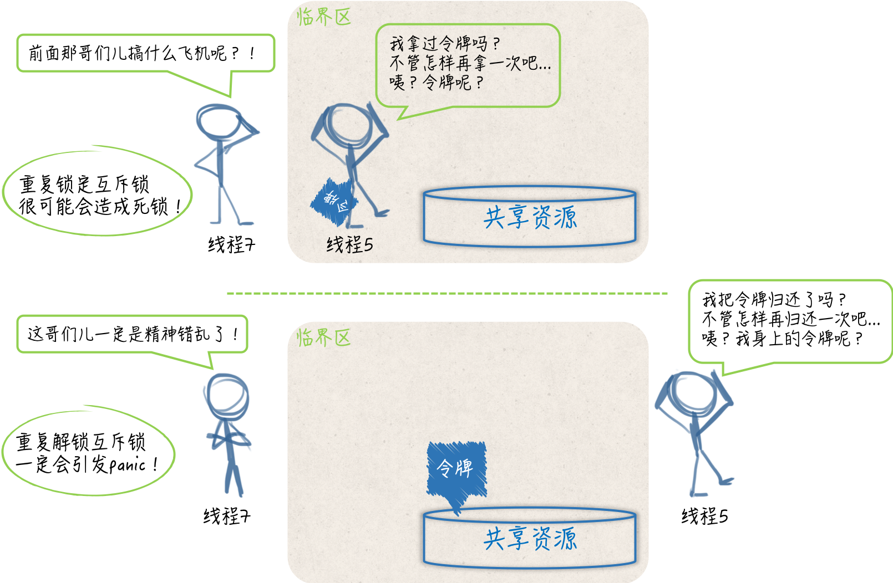

## 静态条件、临界区和同步工具

相比于 Go 语言宣扬的 用通讯的方式共享数据，通过共享数据的方式来传递信息和协调线程运行的做法其实更加主流，毕竟大多数的现代编程语言都是用后一种方式作为并发编程的解决方案的。

一旦数据被多个线程共享，那面就很可能会产生争用和冲突的情况。这种情况也被称为竞态条件（race condition），这往往会破坏共享数据的一致性。

共享数据的一致性代表着某种约定，即：多个线程对共享数据的操作总是可以达到它们各自预期的效果。如果这个一致性得不到保证，那面将会影响到一些线程中代码和流程的正确执行，甚至会造成某种不可预知的错误。这种错误一般很难发现和定位，排查起来的成本也是非常高的，所以一定要尽量避免。

当同时有多个线程向同一个缓冲区写入数据块时，如果没有一个机制去协调这些线程的写入操作的话，那面被写入的数据库就很可能出现错乱。

还记得曾经在一家第三方支付的公司时，每次有人要用打印机前都要大声问有没有人在用，有一次我直接打印了，结果和别人打印的冲突了，一张纸上有我的东西也有另一个同事打印的东西，最后都用不了。当然这是举个例子，在编程来说就是当线程 A 还没有写完一个数据块时，线程 B 就开始写入另外一个数据块了。

显然，这两个数据块中的数据会被混在一起，并且已经很难分清了。因此，这种情况下，我们需要采取一些措施来协调它们对缓冲区的修改。这通常会涉及到同步。

概括来讲，同步的用途有两个，一个是避免多个线程在同一时刻操作同一个数据块，另一个是协调多个线程，以避免它们在同一时刻执行同一个代码块。

由于这样的数据块和代码块的背后都隐含着一种或多种资源（如：存储资源、计算资源、I/O资源、网络资源等），所以我们可以把它们看作是共享资源，或者是共享资源的代表。我们所说的同步其实就是在控制多个线程对共享资源的访问。

一个线程在想要访问某一个共享资源时，需要先申请对该资源的访问权限，并且只有在申请成功后才能真正开始访问。当线程对共享资源的访问结束时，必须归还对该资源的访问权限，再次访问时需要重新申请。

我们可以把访问权限想象成一块令牌，线程一旦拿到了令牌，就可以进入指定区域从而访问到资源。而一旦线程要离开这个区域了，就需要把令牌还回去，绝对不能把令牌带走。

如果针对某个共享资源的访问权限令牌只有一块，那么在同一时刻，就最多只能有一个线程进入那个区域并访问到该资源。这时，我们可以说多个并发运行的线程对这个共享资源的访问是完全串行的。只要一个代码片段需要实现对共享资源的串行化访问，就可以被视为一个临界区（critical section），也就是要访问到资源而必须进入的那个区域。

如前面所述，实现了数据块写入操作的代码就共同组成了一个临界区。如果针对同一个共享资源，这样的代码片段有多个，那么它们就可以被称为相关临界区。

它们可以是一个内含了共享数据的结构体及其方法，也可以是操作同一块共享数据的多个函数。临界区总是需要收到保护的，否则就会产生竞态条件。施加保护的重要手段之一，就是使用实现了某种同步机制的工具，也称为同步工具。


## `mutex` 互斥锁

在 Go 语言中，可供我们选择的同步工具并不少。其中，最重要且最常用的同步工具当属互斥量（mutual exclusion，简称 mutex）。sync 包中的 Mutex 就是与其对应的类型，该类型的值可以被称为互斥量或者互斥锁。

一个互斥锁可以被用来保护一个临界区或者一组相关临界区。我们可以通过它来保证在同一个时刻只有一个 goroutine 处于该临界区之内。

为了兑现这个保证，每当有 goroutine 想进入临界区时，都需要先对它进行锁定，并且每个 goroutine 离开临界区时，都要及时的对它进行解锁。

锁定操作可以通过调用互斥锁的 Lock 方法实现，解锁操作可以调用互斥锁的 Unlock 方法实现：

```go
mu.Lock()
_, err := writer.Write([]byte(data))
if err != nil {
 log.Printf("error: %s [%d]", err, id)
}
mu.Unlock()
```

这里的互斥锁就相当于我们之前说的访问令牌。

## 使用互斥锁的注意事项

- 不要重复锁定互斥锁。
- 不要忘记解锁，必要时使用 defer。
- 不要对尚未锁定或者已解锁的互斥锁解锁。
- 不要在多个函数之间传递互斥锁。

首先，我们还是要把互斥锁看作是针对某一个临界区或者一组相关临界区的唯一访问令牌。虽然没有任何强制规定来限制用同一个互斥锁保护多个无关的临界区，但是这样做一定会让程序变得更复杂，并且也会明显的增加我们的心智负担。

要知道，对一个已经被锁定的互斥锁进行锁定，是会立即阻塞当前的 goroutine 的。这个 goroutine 所执行的流程，会一直停滞在调用该互斥锁的 Lock 方法的那行代码上。直到该互斥锁的 Unlock 方法被调用，并且这里的锁定操作完成，后续的代码（临界区中的代码）才会开始执行。这也是互斥锁能够保护临界区的原因所在。

一旦我们把一个互斥锁同时用在了多个地方，就必然会有更多的 goroutine 争用这把锁。这不但会让我们的程序变慢，还会大大增加死锁（deadlock）的可能性。

所谓的死锁，指的就是当前程序中的主 goroutine，以及我们启用的那些 goroutine 都已经阻塞。这些 goroutine 可以被统称为用户级的 goroutine。这就相当于整个程序已经停滞不前了。

Go 语言运行时系统是不允许这种情况出现的，只要它发现所有的用户级 goroutine 都处于等待状态，就会自行抛出一个带有如下信息的 panic：

```go
fatal error: all goroutines are asleep - deadlock!
```

这种 Go 运行时系统自行抛出的 panic 都属于致命错误，都是无法被恢复的，调用 recover 函数对它们起不到任何作用。也就是说，一旦产生死锁，程序必然崩溃。

因此，我们一定要尽量避免这种情况的发生。而最简单、有效的方式就是让每一个互斥锁都只保护一个临界区或一组相关临界区。在这个前提下，我们还要注意对于同一个 goroutine 而言，既不要重复锁定一个互斥锁，也不要忘记对它进行解锁。

一个 goroutine 对某一个互斥锁的重复锁定，就意味着它自己锁死了自己。先不说这种情况本身就是错误的，这种情况下想让其他 goroutine 来帮它解锁是非常难以保证其正确性的。

在一个 goroutine 执行的流程中，可能会出现诸如锁定、解锁、再锁定、再解锁的操作，如果我们忘记了中间的解锁操作，那么就一定会造成重复锁定。此外，忘记解锁还会使其他的 goroutine 无法进入到该互斥锁保护的临界区，这轻则会导致一些程序功能的失效，重则会造成死锁和程序崩溃。

很多时候，一个函数执行的流程并不是单一的，流程中间可能会分叉，也可能会终端。如果一个流程在锁定了某个互斥锁之后分叉了，或者有被终端的可能，那么就应该使用 defer 语句来对它进行解锁，而且这样的 defer 语句应该紧跟在锁定操作之后。这是最保险的一种做法。

忘记解锁导致的问题有时候是比较隐蔽的，并不会那么快就暴露出来。这也是我们需要特别关注它的原因。相比之下，解锁未锁定的互斥锁会立即引发 panic。并且与死锁导致的 panic 一样，它们是无法被恢复的。因此，我们总是应该保证对于每一个锁定操作都要有且只要一个对应的解锁操作。



Go 语言中的互斥锁是开箱即用的，一旦我们声明了个 sync.Mutex 类型的变量，就可以直接使用它了。不过要注意，该类型是一个结构体类型，属于值类型中的一种。把它传给一个函数、将它从函数中返回、把它赋值给变量、让它进入某个通道都会导致它的副本产生。

并且原值和它的副本，以及多个副本之间都是完全独立的，它们都是不同的互斥锁。

如果把一个互斥锁当做参数值传给了一个函数，那面在函数中对锁的所有操作都不会对存在于该函数之外的原锁产生任何影响。

## 读写锁和互斥锁的异同

读写锁是 读/写互斥锁的简称。在 Go 语言中，读写锁由 sync.RWMutex 类型的值代表。与 sync.Mutex 类型一样，这个类型也是开箱即用的。

顾名思义，读写锁是把对共享资源的读操作和写操作区别对待了。它可以对这两种操作施加不同程度的保护。相比于互斥锁，读写锁可以实现更加细腻的访问控制。

一个读写锁中实际上包含了两个锁，即：读锁和写锁。sync.RWMutex 类型中的 Lock 方法和 Unlock 方法分别用于对写锁进行锁定和解锁，而它的 RLock 方法和 RUnlock 方法则分别用于对读锁进行锁定和解锁。

另外，对于同一个读写锁来说有如下规则：

- 在写锁已被锁定的情况下再试图锁定写锁，会阻塞当前的 goroutine。
- 在写锁已被锁定的情况下试图锁定读锁，也会阻塞当前的 goroutine。
- 在读锁已被锁定的情况下试图锁定写锁，同样会阻塞当前的 goroutine。
- 在读锁已被锁定的情况下再试图锁定读锁，并不会阻塞当前的 goroutine。

对于某个受到读写锁保护的共享资源，多个写操作不能同时进行，写操作和读操作也不能同时进行，但多个读操作却可以同时进行。

当然了，只有在我们正确使用读写锁的情况下才能达到这种效果。还是那句话，我们需要让每一个锁都只保护一个临界区或者一组相关临界区，并以此尽量减少误用的可能性。我们通常把这种不能同时进行的操作称作互斥操作。

对写锁进行解锁，会唤醒所有因试图锁定读锁而被阻塞的 goroutine。通常会使它们都成功完成对读锁的锁定。

对读锁进行解锁，只会在没有其他读锁锁定的前提下，唤醒因试图锁定写锁，而被阻塞的 goroutine，最终只会有一个被唤醒的 goroutine 能够成功完成对写锁的锁定，其他的 goroutine 还要原地等待。至于是哪个 goroutine，就要看谁的等待时间最长了。

此外，读写锁对写操作之间的互斥其实是通过它内含的一个互斥锁实现的。也可以说 Go 语言的读写锁是互斥锁的一种扩展。

与互斥锁类似，解锁读写锁中未被锁定的写锁，会立即引发 panic，对于读锁也是如此，并且不能恢复。