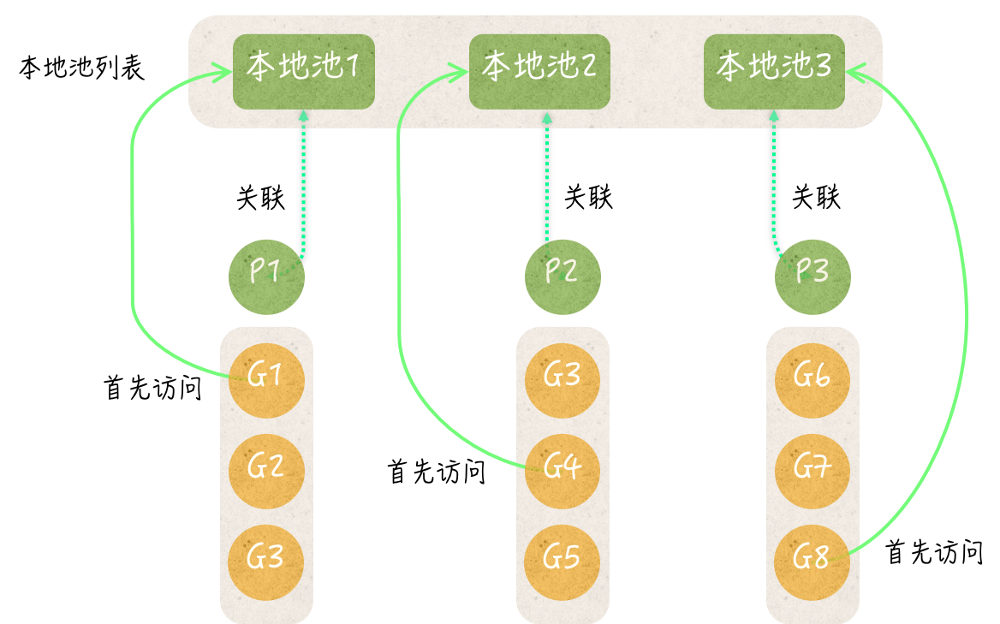
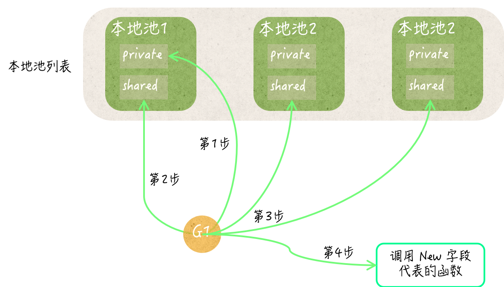

sync.Pool 类型可以被称为临时对象池，它的值可以被用来存储临时的对象。与 Go 语言的很多同步工具一样，sync.Pool 也属于结构体类型，它的值在真正被使用后，就不应该再被复制了。

这里的临时对象的意思是：不需要持久使用的某一类值。这类值对程序来说可有可无，如果有则更好。它们的创建或销毁可以在任何时候发生，并且完全不会影响到程序的功能。

同时，它们也应该是无需区分的，其中的任何一个值都可以代替另一个。如果某类值完全满足上述条件，那么就可以把它们存储到临时对象池中。例如，我们可以把临时对象池当做某种数据的缓存来用，这也是临时对象池的主要用途。

sync.Pool 类型只有两个方法：Put 和 Get。Put 用于在当前的池中存放临时对象，它接受一个 interface{} 类型的参数。Get 用于从当前的池中获取临时对象，它会返回一个 interface{} 类型的值。

更具体的说，Get 方法可能会从当前的池中删除掉任何一个值，然后把这个值作为结果返回。如果当前池中没有任何值，那么这个方法就会使用当前池的 New 字段创建一个新值，并直接将其返回。

## 临时对象创建

sync.Pool 类型的 New 字段代表创建临时对象的函数。它是一个没有参数但有唯一结果的函数类型：`New func() interface{}`。这个函数是 Get 方法最后的临时对象获取手段。如果 Get 方法到了最后扔无法获取到一个值，那么就会调用该函数。该函数的结果值并不会被存入当前的临时对象池中，而是直接返回给 Get 方法的调用方。

这里的 New 字段的实际值需要我们在初始化时给定。否则调用它的 Get 方法时就有可能会得到 nil。所以 sync.Pool 类型不是开箱即用的。

标准库代码包 fmt 就使用到了 sync.Pool 类型。这个包会创建一个用于缓存某类临时对象的 sync.Pool 类型值，并将这个值赋给一个名为 ppFree 的变量。这类临时对象可以识别、格式化和暂存需要打印的内容。

```go
var ppFree = sync.Pool{
     New: func() interface{} { return new(pp) },
}
```

临时对象池 ppFree 的 New 字段在被调用的时候，总是会返回一个全新的 pp 类型值的指针（即临时对象）。这就保证了 ppFree 的 Get 方法总能返回一个可以包含需要打印内容的值。

pp 类型是 fmt 包中的私有类型，它有很多实现了不同功能的方法。不过，这里的重点是，它的每一个值都是独立的、平等的和可重用的。

> 更具体地说，这些对象既互不干扰，又不会受到外部状态的影响。它们几乎只针对某个需要打印内容的缓冲区而已。由于 fmt 包中的代码在真正使用这些临时对象之前，总是会先对其进行重置，所以它们并不在意取到的是哪一个临时对象。这就是临时对象的平等性的具体体现。

另外，这些代码在使用完临时对象之后，都会先抹掉其中已缓冲的内容，然后再把它存放到 ppFree 中。这样就为重用这类临时对象做好了准备。

众所周知的 fmt.Println、fmt.Printf 等打印函数都是如此使用 ppFree，以及其中的临时对象的。因此，在程序同时执行很多的打印函数调用的时候，ppFree 可以及时地把它缓存的临时对象提供给它们，以加快执行的速度。

而当程序在一段时间内不再执行打印函数调用时，ppFree 中的临时对象又能够被及时地清理掉，以节省内存空间。

在这个维度上，临时对象池可以帮助程序实现可伸缩性。这就是它的最大价值。

## 临时对象销毁

sync 包在被初始化时会向 Go 语言运行时系统注册一个函数，这个函数的功能就是清除所有已创建的临时对象池中的值。我们称为池清理函数。该函数注册成功后，Go 语言运行时系统每次即将执行垃圾回收时就会执行它。

另外，在 sync 包中还有一个包级私有的全局变量。这个变量代表了当前的程序中使用的所有临时对象池的汇总，它是元素类型为 *sync.Pool 的切片。我们称为池汇总列表。

通常，在一个临时对象池的 Put 或 Get 方法第一次被调用时，这个池会被添加到池汇总列表中。因此，池清理函数总是能访问到所有正在被真正使用的临时对象池。

更具体的说，池清理函数会遍历池汇总列表。对于其中的每个临时对象池，都会先将池中的私有临时对象和共享临时对象列表都设置为 nil，然后再把这个池中所有本地池列表销毁掉。最后，池清理函数会把池汇总列表重置为空的切片。这样，这些池中存储的临时对象就被全部清理干净了。

如果临时对象池以外的代码再无对它们的引用，之后的垃圾回收过程就会把这些临时对象当做垃圾销毁掉，回收它们占用的内存以备他用。

## 临时对象池的数据结构

临时对象池中有一个多层的数据结构，所以才能高效的存储大量的值。这个数据结构的顶层，我们可以称为本地池列表，确切的说，它是一个数组。这个列表的长度总是与 Go 语言调度器中的 P 数量相同。

Go 语言调度器中的 P 是 processor 的缩写，指的是一种可以承载若干个 G 且能够使这些 G 适时的与 M 进行对接，并得到真正的运行。

G 是 goroutine 的缩写，M 是 machine 的缩写，指代系统级线程。正因为有了 P 的存在，G 和 M 才能灵活、高效的配对，以实现强大的并发编程模型。

P 存在的一个很重要的原因是为了分散并发程序的执行压力，而让临时对象池中的本地池列表的长度与 P 的数量相同的主要原因也是分散压力。这里说的压力包括存储和性能两个方面。在说明它们之前，先来看下临时对象池中的数据结构。

在本地池列表中的每个本地池都包含了三个字段，它们是：存储私有临时对象的字段 private、代表了共享临时对象列表的 shared，以及一个 sync.Mutex 类型的嵌入字段。



实际上，每个本地池都对应一个 P。一个 goroutine 想要真正运行就必须先与某个 P 产生关联。也就是说，一个正在运行的 goroutine 必然会关联着某个 P。在程序调用临时对象池的 Put 或 Get 方法时，总会先试图从该临时对象池的本地列表中获取与之对应的本地池，依据就是与当前的 G 关联的 P 的 ID。换句话说，一个临时对象池的 Put 或 Get 方法会获取到哪一个本地池，完全取决于调用它的代码所在的 G 关联的那个 P。

## 临时对象池是怎样利用内部数据结构来存取值的

临时对象的 Put 方法总会先试图把新的临时对象存储到对应的本地池的 private 字段中，以便在后面获取临时对象时可以快速拿到一个可用的值。只有当这个 private 字段已经存有某个值是，该方法才会去访问本地池的 shared 字段。

相应的，临时对象池的 Get 方法总会先试图从对应的本地池的 private 字段处获取一个临时对象，只有当这个 private 字段为 nil 时，才会去访问本地池的 shared 字段。

一个本地池的 shared 字段原则上是可以被任何 G 中的代码访问到，不论这个 G 关联的哪一个 P。这也是我们把它叫做共享临时对象列表的原因。

一个本地池的 private 字段只可能被与之对应的那个 P 所关联的 G 中的代码访问到，所以可以说它是 P 级私有的。

以临时对象池的 Put 方法为例，它一旦发现对应的本地池的 private 字段已存有值，就会去访问这个本地池的 shared 字段。由于 shared 字段是共享的，所以此时必须受到互斥锁的保护。本地池嵌入的那个 sync.Mutex 就是这里的互斥锁。也就是说，本地池本身就拥有互斥锁的功能。Put 方法会在互斥锁的保护下把新的临时对象追加到共享临时对象列表的末尾。

相应的，临时对象池的 Get 方法在发现对应的本地池的 private 字段未存有值时，也会去访问 shared 字段。它会在互斥锁的保护下试图把共享临时对象列表中的最后一个元素值取出当做结果返回。

这里的共享临时对象列表也有可能是空的，可能是被取走了也可能是刚被清理过。无论什么原因 Get 方法都会去访问当前临时对象池中的所有本地池，并且逐个搜索它们的共享临时对象列表。



即使这样也有可能无法拿到一个可用的临时对象，这时候就会调用 New 字段代表的创建临时对象的函数，创建一个临时对象并返回。