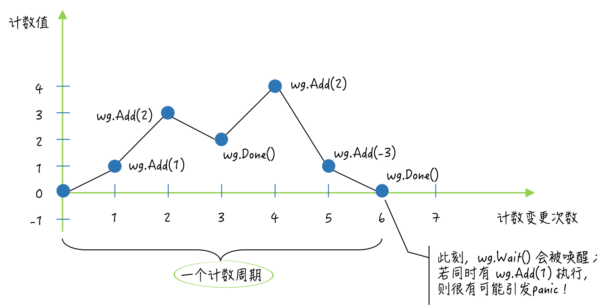

## sync 包的 WaitGroup 类型

主 goroutine 等待其他手动启动的 goroutine 时可以考虑 sync.WaitGroup 类型，它比通道更适合实现这种一对多的 goroutine 协作流程。

sync.WaitGroup 是开箱即用的，也是并发安全的。同时，它一旦被真正使用就不能被复制了。它有三个指针方法：Add、Done 和 Wait。

```go
// A WaitGroup waits for a collection of goroutines to finish.
// The main goroutine calls Add to set the number of
// goroutines to wait for. Then each of the goroutines
// runs and calls Done when finished. At the same time,
// Wait can be used to block until all goroutines have finished.
//
// A WaitGroup must not be copied after first use.
type WaitGroup struct {
	noCopy noCopy

	// 64-bit value: high 32 bits are counter, low 32 bits are waiter count.
	// 64-bit atomic operations require 64-bit alignment, but 32-bit
	// compilers do not ensure it. So we allocate 12 bytes and then use
	// the aligned 8 bytes in them as state, and the other 4 as storage
	// for the sema.
	state1 [3]uint32
}
```

我们可以想象它有一个计数器，默认值是 0。可以通过 Add 方法来增加或减少计数器的值。一般用来记录需要等待的 goroutine 数量。

它的 Done 方法用于对计数器的值进行减一操作，我们可以在需要等待的 goroutine 中通过 defer 语句调用它。

Wait 方法用于阻塞当前 goroutine，直到其所属值中的计数器归零。如果该方法被调用时计数器就是 0，它将不会做任何事。

```go
package main

import (
	"fmt"
	"sync"
	"sync/atomic"
	"time"
)

func main() {
	var wg sync.WaitGroup
	wg.Add(2)
	num := int32(0)
	max := int32(10)
	addNum(&num, 1, max, wg.Done)
	addNum(&num, 2, max, wg.Done)
	wg.Wait()
}

func addNum(num *int32, id, max int32, deferFunc func()) {
	defer func() {
		deferFunc()
	}()
	for i := 1; ; i++ {
		currNum := atomic.LoadInt32(num)
		if currNum >= max {
			break
		}
		newNum := currNum + 2
		time.Sleep(time.Nanosecond * 200)
		if atomic.CompareAndSwapInt32(num, currNum, newNum) {
			fmt.Printf("The number: %d [%d-%d]\n", newNum, id, i)
		} else {
			fmt.Printf("The CAS operation failed. [%d-%d]\n", id, i)
		}
	}
}
```

首先声明了一个 WaitGroup 类型的变量 wg。然后，调用了它的 Add 方法并传入了 2，因为后面会启用两个需要等待的 goroutine。

由于 wg 变量的 Done 方法本身就是一个既无参数声明，也无结果声明的函数，所以在 go 语句中调用 addNum 函数的时候，可以直接把该方法作为最后一个参数值传进去。

最后，调用了 wg 的 Wait 方法。如此一来，该函数就可以等到那两个 goroutine 都运行结束之后，再结束执行了。

以上就是 WaitGroup 类型最典型的应用场景了。

## sync.WaitGroup 类型值的计数器

计数器的值是不可以小于 0 的，这样会引发一个 panic，不适当的调用这类值的 Done 和 Add 方法都会如此。Add 方法是可以传入负数的。

我们声明了这样一个变量后，应该首先根据需要等待的 goroutine 或者其他事件的数量调用它的 Add 方法，以使它的计数器大于 0。这是确保我们能在后面正常的使用这类值的前提。

如果我们对它的 Add 方法的首次调用与对它的 Wait 方法的调用是同时发起的，比如，同时启动的两个 goroutine 中，分别调用这两个方法，那么就有可能让这里的 Add 方法抛出一个 panic。

这种情况不容易复现，我们更应该重视。虽然 sync.WaitGroup 值本身不需要初始化，但是尽早增加计数器的值还是很有必要的。

另外，WaitGroup 值是可以复用的，但是需要保证其计数周期的完整性。计数周期是指：该值中的计数器值由 0 变为某个正整数，经过一系列的变化之后，最终又变回 0。

就是说，计数器的值始于 0 又归于 0，就可以被视为一个计数周期。在一个此类值的生命周期中，它可以经历任意多个计数周期。但是只有当它走完当前的计数周期后，才可以开始下一个计数周期。



因此，也可以说，如果此类值的 Wait 方法在它某个计数周期中被调用，就会立即阻塞当前 goroutine，知道这个计数周期完成。然后该值的下一个计数周期必须等待 Wait 方法执行结束后才能够开始。如果在一个此类值的 Wait 方法被执行期间，跨越了两个计数周期，就会引发一个 panic。

例如，在当前的 goroutine 因调用此类值的 Wait 方法，而被阻塞的时候，另一个 goroutine 调用了该值的 Done 方法，并使其计数器的值变为了 0。

这会唤醒当前的 goroutine，并使它试图继续执行 Wait 方法中其余的代码。但在这时，又有一个 goroutine 调用了它的 Add 方法，并让其计数器的值又从 0 变为了某个正整数。此时，这里的 Wait 方法就会立即抛出一个 panic。

纵观上述会引发 panic 的后两种情况，我们可以总结出这样一条关于 WaitGroup 值的使用禁忌，即：不要把增加其计数器值的操作和调用其 Wait 方法的代码，放在不同的 goroutine 中执行。换句话说，要杜绝对同一个 WaitGroup 值的两种操作的并发执行。

## sync.Once 类型值的 Do 方法怎样保证只执行一次

与 sync.WaitGroup 类型一样，sync.Once 类型也属于结构体类型，也是开箱即用和并发安全的。由于该类型中包含了一个 sync.Mutex 类型的字段，所以也是不能复制的。

```go
// Once is an object that will perform exactly one action.
type Once struct {
	// done indicates whether the action has been performed.
	// It is first in the struct because it is used in the hot path.
	// The hot path is inlined at every call site.
	// Placing done first allows more compact instructions on some architectures (amd64/x86),
	// and fewer instructions (to calculate offset) on other architectures.
	done uint32
	m    Mutex
}
```

Once 类型的 Do 方法只接受一个参数，这个参数的类型必须是 func()，即：无参数声明和结果声明的函数。

该方法的功能并不是对每一种参数函数都只执行一次，而是只执行首次被调用时传入的那个函数，并且之后不会再执行任何参数函数。

所以，如果有多个只需要执行一次的函数，那么就应该为它们中的每一个都分配一个 sync.Once 类型的值。

Once 类型中还有一个名叫 done 的 uint32 类型的字段。它的作用是记录其所属值的 Do 方法被调用的次数。不过，该字段的值只可能是0 或者 1。一旦 Do 方法的首次调用完成，它的值就会从 0 变为 1。

并且因为对它的操作必须是原子的。Do 方法在一开始就会通过调用 atomic.LoadUint32 函数来获取该字段的值，并且一旦发现该值为1，就会直接返回。这也初步保证了 Do 方法，只会执行首次被调用时传入的函数。

不过，单凭这样一个判断的保证是不够的。因为，如果有两个 goroutine 都调用了同一个新的 Once 值的 Do 方法，并且几乎同时执行到了其中的这个条件判断代码，那么它们就都会因判断结果为 false，而继续执行 Do 方法中剩余的代码。

在这个条件判断之后，Do 方法会立即锁定其所属值中的那个 sync.Mutex 类型的字段 m。然后，它会在临界区中再次检查 done 字段的值，并且仅在条件满足时，才会去调用参数函数，以及用原子操作把 done 的值变为 1。

这个 Do 方法的实现方式，与单例模式有很多相似之处。它们都会先在临界区之外，判断一次关键条件，若条件不满足则立即返回。这通常被称为 快路径或者快速失败路径。

如果条件满足，那么到了临界区中还要再对关键条件进行一次判断，这主要是为了更加严谨。这两次条件判断常被统称为（跨临界区的）双重检查。

由于进入临界区之前，肯定要锁定保护它的互斥锁 m，显然会降低代码的执行速度，所以其中的第二次条件判断，以及后续的操作就被称为慢路径或者常规路径。

```go
// Do calls the function f if and only if Do is being called for the
// first time for this instance of Once. In other words, given
// 	var once Once
// if once.Do(f) is called multiple times, only the first call will invoke f,
// even if f has a different value in each invocation. A new instance of
// Once is required for each function to execute.
//
// Do is intended for initialization that must be run exactly once. Since f
// is niladic, it may be necessary to use a function literal to capture the
// arguments to a function to be invoked by Do:
// 	config.once.Do(func() { config.init(filename) })
//
// Because no call to Do returns until the one call to f returns, if f causes
// Do to be called, it will deadlock.
//
// If f panics, Do considers it to have returned; future calls of Do return
// without calling f.
//
func (o *Once) Do(f func()) {
	// Note: Here is an incorrect implementation of Do:
	//
	//	if atomic.CompareAndSwapUint32(&o.done, 0, 1) {
	//		f()
	//	}
	//
	// Do guarantees that when it returns, f has finished.
	// This implementation would not implement that guarantee:
	// given two simultaneous calls, the winner of the cas would
	// call f, and the second would return immediately, without
	// waiting for the first's call to f to complete.
	// This is why the slow path falls back to a mutex, and why
	// the atomic.StoreUint32 must be delayed until after f returns.

	if atomic.LoadUint32(&o.done) == 0 {
		// Outlined slow-path to allow inlining of the fast-path.
		o.doSlow(f)
	}
}

func (o *Once) doSlow(f func()) {
	o.m.Lock()
	defer o.m.Unlock()
	if o.done == 0 {
		defer atomic.StoreUint32(&o.done, 1)
		f()
	}
}
```

### Do 方法的两个特点

第一个特点，由于 Do 方法只会在参数函数执行结束之后把 done 字段的值变为 1，因此，如果参数函数的执行需要很长时间或者根本就不会结束（比如执行一些守护任务），那么就有可能会导致相关 goroutine 的同时阻塞。

例如，有多个 goroutine 并发地调用了同一个 Once 值的 Do 方法，并且传入的函数都会一直执行而不结束。那么，这些 goroutine 就都会因调用了这个 Do 方法而阻塞。因为，除了那个抢先执行了参数函数的 goroutine 之外，其他的 goroutine 都会被阻塞在锁定该 Once 值的互斥锁 m 的那行代码上。

第二个特点，Do 方法在参数函数执行结束后，对 done 字段的赋值用的是原子操作，并且，这一操作是被挂在 defer 语句中的。因此，不论参数函数的执行会以怎样的方式结束，done 字段的值都会变为 1。

也就是说，即使这个参数函数没有执行成功（比如引发了一个 panic），我们也无法使用同一个 Once 值重新执行它了。所以，如果你需要为参数函数的执行设定重试机制，那么就要考虑 Once 值的适时替换问题。