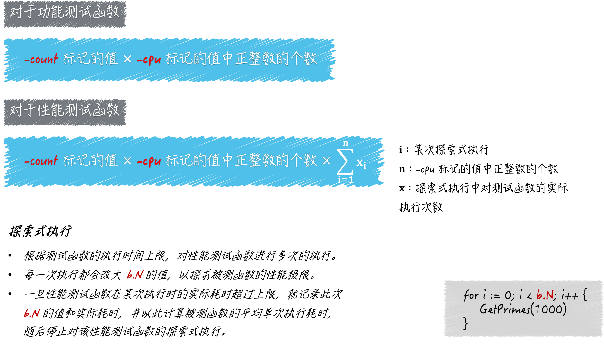

## `-cpu` 的功能

`go test` 命令的标记 `-cpu`，它是用来设置测试执行最大 `P` 数量的列表的。

> 这里的 P 是 processor 的缩写，每个 processor 都是一个可以承载若干个 G，且能够使这些 G 适时地与 M 进行对接并得到真正运行的中介。正是由于 P 的存在，G 和 M 才可以呈现出多对多的关系，并能够及时、灵活地进行组合和分离。这里的 G 就是 goroutine 的缩写，可以被理解为 Go 语言自己实现的用户级线程。M 即为 machine 的缩写，代表着系统级线程，或者说操作系统内核级别的线程。

`Go` 语言并发模型中的 `P`，正是 `goroutine` 的数量能够数十万计的关键。`P` 的数量意味着 `Go` 程序背后的运行时系统中，会有多少个用于承载可运行的 `G` 的队列存在。

每一个队列相当于一条流水线，它会源源不断的把可运行的 G 输送给空闲的 M，并使这两者对接。

一旦完成对接，被对接的 G 就真正运行在操作系统的内核级线程上了，每条流水线之间虽然会有联系，但都是独立运作的。

因此，最大 P 数量就代表着 Go 语言运行时系统同时运行 goroutine 的能力，也可以被视为其中逻辑 CPU 的最大个数。而 go test 命令的 -cpu 标记正是用于设置这个最大个数的。

默认情况下，最大 P 数量就等于当前计算机 CPU 核心的实际数量。我们可以通过使用 -cpu 模拟被测程序在计算能力不同的计算机中的表现。

## 怎样设置 -cpu 的值，它会对测试流程产生怎样的影响

标记 -cpu 的值应该是一个正整数的列表，该列表的表现形式为，以英文半角逗号分隔的多个整数字面量。如：1,2,4。

针对于此值中的每一个正整数，go test 命令都会先设置最大 P 数量为该数，然后在执行测试函数。

如果测试函数有多个，那么 go test 命令会依照此方式逐个执行。

> 以1,2,4为例，go test 命令会先以 1,2,4 为最大 P 数量分别去执行第一个测试函数，之后再用同样的方式执行第二个测试函数，以此类推。

go test 命令在进行准备工作的时候会读取 -cpu 标记的值，并把它转换为一个以 int 为元素类型的切片，我们也可以称它为逻辑 CPU 切片。

如果该命令发现我们并没有追加这个标记，那么就会让逻辑 CPU 切片只包含一个元素，即最大 P 数量的默认值，也就是当前计算机 CPU 的实际数量。

当准备执行某个测试函数的时候，go test 命令都会迭代逻辑 CPU 切片，并在每次迭代时，根据当前元素值设置最大 P 数量，然后再去执行测试函数。

注意，对于性能测试函数，这里可能不止执行了一次。概括来讲，go test 命令对每一次性能测试函数的执行，都是一个探索过程。它会在测试函数的执行时间上限不变的前提下，尝试找到被测程序的最大执行次数。在这个过程中，性能测试函数可能会被执行多次。

> 对性能测试函数的一次探索式执行，这其中包含了对该函数的若干次执行，当然也包括了对被测程序的更多次执行。

## -count 标记

-count 标记是专门用于重复执行测试函数的。它的值必须大于或等于 0，并且默认值为 1。

如果我们在运行 go test 命令时追加了 -count 5，那么对于每个测试函数，命令都会在预设不同条件下分别重复执行五次。 

如果我们把前文所述的 -cpu 标记、-count 标记，以及探索式执行联合起来看，就可以用一个公式来描述单个性能测试函数，在 go test 命令的一次运行过程中的执行次数，即：

```go
性能测试函数的执行次数 = `-cpu`标记的值中正整数的个数 x `-count`标记的值 x 探索式执行中测试函数的实际执行次数
```

对于功能测试函数来说，这个公式会更简单一些，即：

```go
功能测试函数的执行次数 = `-cpu`标记的值中正整数的个数 x `-count`标记的值
```



## -parallel 标记

我们在运行 go test 命令的时候，可以追加标记 -parallel，该标记的作用是：设置同一个被测代码包中的功能测试函数的最大并发执行数。该标记的默认值是测试运行时的最大 P 数量（这可以通过调用表达式 runtime.GOMAXPROCS(0) 获得）。

对于功能测试，为了加快测试速度，命令通常会并发地测试多个被测代码包。但是，在默认情况下，对于同一个被测代码包中的多个功能测试函数，命令会串行地执行它们。除非我们在一些功能测试函数中显式地调用 t.Parallel 方法。

这个时候，这些包含了 t.Parallel 方法调用的功能测试函数就会被 go test 命令并发地执行，而并发执行的最大数量正是由 -parallel 标记值决定的。不过要注意，同一个功能测试函数的多次执行之间一定是串行的。

最后，强调一下，-parallel 标记对性能测试是无效的。当然了，对于性能测试来说，也是可以并发进行的，不过机制上会有所不同。

概括地讲，这涉及了 b.RunParallel 方法、b.SetParallelism 方法和 -cpu 标记的联合运用。

## 性能测试函数中的计时器

testing 包中的 testing.B 类型有这么几个指针方法：StartTimer、StopTimer 和 ResetTimer。这些方法都是用于操作当前的性能测试函数专属的计时器的。

所谓的计时器，是一个逻辑上的概念，它其实是 testing.B 类型中一些字段的统称。这些字段用于记录：当前测试函数在当次执行过程中耗费的时间、分配的堆内存的字节数以及分配次数。

这三个方法在开始记录、停止记录或重新记录执行时间的同时，也会对堆内存分配字节数和分配次数的记录起到相同的作用。

实际上，go test 命令本身就会用到这样的计时器。当准备执行某个性能测试函数的时候，命令会重置并启动该函数专属的计时器。一旦这个函数执行完毕，命令又会立即停止这个计时器。

如此一来，命令就能够准确地记录下测试函数执行时间了。然后，命令就会将这个时间与执行时间上限进行比较，并决定是否在改大 b.N 的值之后，再次执行测试函数。

显然，如果我们在测试函数中自行操作这个计时器，就一定会影响到这个探索式执行的结果。也就是说，这会让命令找到被测程序的最大执行次数有所不同。

```go
func BenchmarkGetPrimes(b *testing.B) {
	b.StopTimer()
	time.Sleep(time.Millisecond * 500) // 模拟某个耗时但与被测程序关系不大的操作。
	max := 10000
	b.StartTimer()

	for i := 0; i < b.N; i++ {
		GetPrimes(max)
	}
}
```

这里先停止了当前测试函数的计时器，然后通过调用 time.Sleep 函数，模拟了一个比较耗时的额外操作，并且在给变量 max 赋值之后又启动了该计时器。

想象一下，我们需要耗费额外的时间去确定 max 变量的值，虽然在后面它会被传入 GetPrimes 函数，但是，针对 GetPrimes 函数本身的性能测试并不应该包含确定参数值的过程。

因此，我们需要把这个过程所耗费的时间，从当前测试函数的执行时间中去除掉。这样就能够避免这一过程对测试结果的不良影响了。

每当这个测试函数执行完毕后，go test 命令拿到的执行时间都只应该包含调用 GetPrimes 函数所耗费的那些时间。只有依据这个时间做出的后续判断，以及找到被测程序的最大执行次数才是准确的。

在性能测试函数中，我们可以通过对 b.StartTimer 和 b.StopTimer 方法的联合运用，再去除掉任何一段代码的执行时间。

相比之下，b.ResetTimer 方法的灵活性就要差一些了，它只能用于：去除在调用它之前那些代码的执行时间。不过，无论在调用它的时候，计时器是不是正在运行，它都可以起作用。