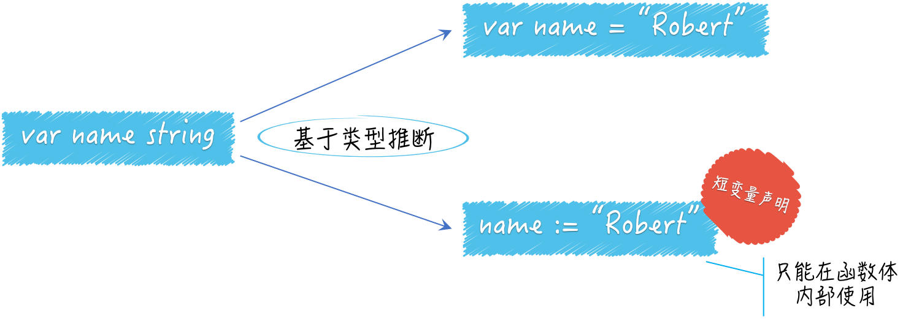

## 变量声明



除了 `var name string` 这种声明方式以外还有两种基于类型推断的声明方式。

注意短变量声明只能在函数体内部使用。

## 类型推断

类型推断是编程语言在编译器自动解释表达式类型的能力。即：对表达式进行求值后的结果的类型推断。

### 类型推断的好处

类型推断可以明显提升程序的灵活性，使得代码重构变的更容易，同时又不会给代码的维护增加额外的负担（实际上，它恰恰可以避免散弹式的代码修改）更不会损失程序的运行效率。

```go
package main

import (
	"flag"
	"fmt"
)

func main() {
	var name = getFlag()
	flag.Parse()
	fmt.Printf("Hello %v!\n", *name)
}

func getFlag() *string {
	return flag.String("name", "Joseph", "This greeting object.")
}
```

我们给变量 `name` 赋值时使用了函数封装，对 `flag.String` 函数的调用，并把其结果直接作为 `getFlag` 函数的结果，结果的类型是`*string`。这样变量赋值就变为针对 ``getFlag`` 函数的返回值了。这实际上是对声明并赋值 `name` 变量的那行代码的重构。

> 我们通常把不改变某个程序与外界的任何交互方式和规则，而只改变其内部实现”的代码修改方式，叫做对该程序的重构。重构的对象可以是一行代码、一个函数、一个功能模块，甚至一个软件系统。

接下来，我想要改变 `getFlag` 里面的代码对 `main` 函数不会有任何影响。

### 变量的重声明

通过使用短变量声明，我们可以在同一个代码块中对变量进行重声明。即：对已经存在的变量再次声明。

```go
var err error
name, err := io.WriteString(os.Stdout, "Hello, everyone!\n")
```

使用短变量声明对新变量 `name` 和旧变量 `err` 进行了“声明并赋值”，这时也是对后者的重声明。

使用变量的重声明有几个前提条件：

- 变量的类型初始化时已经确定了，所以重声明时变量类型必须和之前保持一致。
- 变量的初始和重声明必须发生在同一个代码块中。
- 变量的重声明只有在使用短变量声明是才会发生。
- 重声明时的变量必须是多个且至少有一个是新变量。