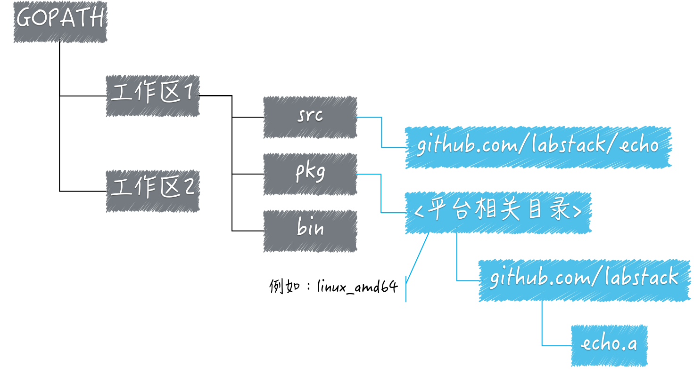

## 前言
我们都知道 `Go` 的环境安装需要配置三个环境变量，他们分别是：

- GPROOT：`Go`语言安装根目录的路径，也就是`Go`语言的安装路径。
- GOBIN：`Go`程序生成的可执行文件（executable file）的路径。
- GOPATH：指向工作区目录的路径，是我们自定义的工作空间，可定义多个。


## 设置 `GOPATH` 有什么意义？

之前只知道`GOPATH`是`Go`语言的工作目录，他的值是一个或者多个路径（不同系统分隔符不同），每个路径代表`Go`语言的一个工作区。

我们利用这些工作区去防止`Go`语言的源码文件（source file），已经安装后的归档文件（archive file）和可执行文件（executable file）。

事实上，由于`Go`语言项目在其生命周期内的所有操作（编码、依赖管理、构建、测试、安装等）基本上都是围绕`GOPATH`和工作区进行的。所以它的背后还有以下几个知识点，分别是：

### 1、`Go`语言源码的组织方式

`Go`语言的源码是以代码包为基本单位的。在文件系统中，这些代码包和目录是一一对应的。由于目录可以有子目录，所以代码包也可以有子包。

一个代码包中可以包含任意个以`.go`为扩展名的源码文件，这些源码文件都需要被声明属于同一个代码包。

代码包的名称一般会与源码文件所在的目录同名。如果不同名，那么在构建、安装的过程中会以代码包名称为准。

每个代码包都有导入路径。代码包的导入路径是其他代码在使用该包中的程序实体时，需要引入的路径。在实际使用程序实体前，我们必须先导入其所在的代码包。具体方式就是`import`该包的导入路径。就像这样：

```go
import "github.com/labstack/echo"
```

在工作区中，一个代码包的导入路径就是从`src`的子目录，到该包的实际存储位置的相对路径。

所以说，`Go`语言源码的组织方式就是以环境变量`GOPATH`、工作区、`src`目录和代码包为主线的。一般情况下，`Go`语言的源码文件都需要被存放在环境变量`GOPATH`包含的某个工作区（目录）中的`src`目录下的某个代码包（目录）中。

### 2、源码安装后的结果

源码文件通常放在工作区下的`src`子目录下；安装后如果产生了归档文件，就会放到该工作区的`pkg`子目录；如果产生了可以执行文件，就会放进该工作区的`bin`子目录下。

源码文件是以代码包的形式组织起来的，一个代码包其实就对应一个目录。安装某个代码包而产生的归档文件是与这个代码包同名的。

放置他的相对目录就是该包的导入路径的直接父级。

比如，一个已存在的代码包的导入路径是：`github.com/labstack/echo`那么执行命令

```go
go install github.com/labstack/echo
```

生成的归档文件就是：`github.com/labstack`，文件名为`echo.a`。

上面这个代码包还有一层含义就是：该代码包的源码文件存放于`Github`上的`labstack`组的代码仓库`echo`中。

归档文件的相对目录与`pkg`目录直接还有一层平台相关目录。平台相关目录的名称是由`build`（也称“构建”）的目标操作系统、下划线和目标计算架构的代号组成的。如：`linux_amd64`。



所以，我们知道某个工作区的 src 子目录下的源码文件在安装后一般会被放置到当前工作区的 pkg 子目录下对应的目录中，或者被直接放置到该工作区的 bin 子目录中。

### 3、构建和安装 Go 程序的过程

构建使用命令`go build`，安装使用命令`go install`。构建和安装代码时都会执行编译、打包等操作，并且这些操作生成的任何文件都会先保存在某个临时目录中。

如果构建的是库源码文件，操作产生的结果文件只会存放在临时目录中。这里的构建的主要意义在于检查和验证。

如果构建的是命令源码文件，操作产生过的结果文件会被搬运到源码文件所在的目录中。

安装操作会先执行构建，然后执行链接操作，并且把结果文件搬运到指定目录。

进一步说，如果安装的是库源码文件，那么结果文件会被搬运到所在工作区的`pkg`目录下的某个子目录中。

如果安装的是命令源码文件，那么结果过文件会被搬运到所在工作区的`bin`目录中或者环境变量`GOBIN`指向的目录中。

## 补充

### 1、`Go`语言在多个工作区中查找依赖包是以怎样的顺序进行的？

以`GOPATH`指定的工作区顺序查找，找到即返回，找不到则报错。

### 2、多个工作区中都存在导入路径相同的代码包会产生冲突吗？

不会冲突，原因同上。同理，不同工作区的两个相同导入路径的代码包，编译的时候不会编译第二个工作区的代码包。